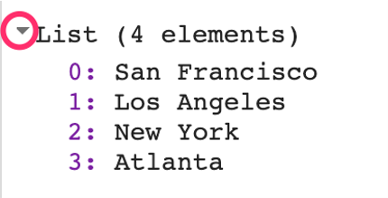
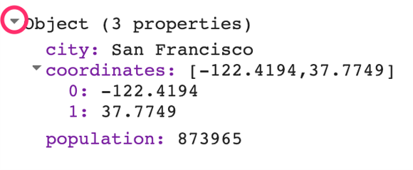
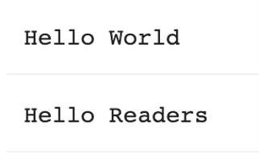
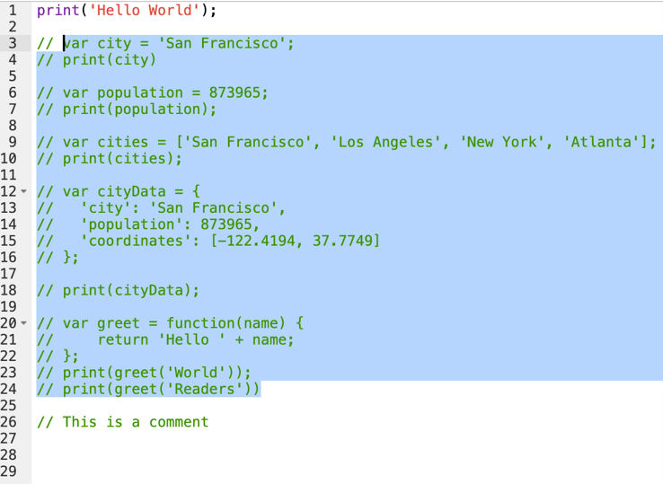

# Overview

To be able to construct a script for your analysis, you will need to use JavaScript. This section covers the JavaScript syntax and basic data structures. In the sections that follow, you will see more JavaScript code, noted in a distinct font and with shaded background. As you encounter code, paste it into the Code Editor and run the script.

**Variables**

In a programming language, variables are used to store data values. In JavaScript, a variable is defined using the `var` keyword followed by the name of the variable. The code below assigns the text “San Francisco” to the variable named city. Note that the text string in the code should be surrounded by quotes. You are free to use either ' (single quotes) or " (double quotes), and they must match at the beginning and end of each string. In your programs, it is advisable to be consistent—use either single quotes or double quotes throughout a given script. Each statement of your script should typically end with a semicolon, although Earth Engine’s code editor does not require it. 

```javascript
var city = 'San Franscisco';
```

If you print the variable city, you will get the value stored in the variable (San Francisco) printed in the **Console**. 

```javascript
print(city);
```

When you assign a text value, the variable is automatically assigned the type `string`. You can also assign numbers to variables and create variables of type number. The following code creates a new variable called population and assigns a number as its value.

```javascript
var population = 873965;
print(population);
```
**Lists**

It is helpful to be able to store multiple values in a single variable. JavaScript provides a data structure called a `list` that can hold multiple values. We can create a new list using the square brackets `[]` and adding multiple values separated by a comma.

```javascript
var cities = ['San Francisco', 'Los Angeles', 'New York', 'Atlanta'];
print(cities);
```

If you look at the output in the **Console**, you will see “List” with an expander arrow (▹) next to it. Clicking on the arrow will expand the list and show you its content. You will notice that along with the four items in the list, there is a number next to each value. This is the index of each item. It allows you to refer to each item in the list using a numeric value that indicates its position in the list.



**Objects**

Lists allow you to store multiple values in a single container variable. While useful, it is not appropriate to store structured data. It is helpful to be able to refer to each item with its name rather than its position. Objects in JavaScript allow you to store key-value pairs, where each value can be referred to by its key. You can create a dictionary using the curly braces `{}`. The code below creates an object called `cityData` with some information about San Francisco. 

Note a few important things about the JavaScript syntax here. First, we can use multiple lines to define the object. Only when we put in the semicolon (`;`) is the command considered complete. This helps format the code to make it more readable. Also note the choice of the variable name `cityData`. The variable contains two words. The first word is in lowercase, and the first letter of the second word is capitalized. This type of naming scheme of joining multiple words into a single variable name is called “camel case.” While it is not mandatory to name your variables using this scheme, it is considered a good practice to follow. Functions and parameters in the Earth Engine API follow this convention, so your code will be much more readable if you follow it too.

```javascript
var cityData = {
    'city': 'San Francisco',
    'coordinates': [-122.4194, 37.7749],
    'population': 873965
};
print(cityData);
```

The object will be printed in the **Console**. You can see that instead of a numeric index, each item has a label. This is known as the key and can be used to retrieve the value of an item.



**Functions**

While using Earth Engine, you will need to define your own functions. Functions take user inputs, use them to carry out some computation, and send an output back. Functions allow you to group a set of operations together and repeat the same operations with different parameters without having to rewrite them every time. Functions are defined using the function keyword. The code below defines a function called greet that takes an input called `name` and returns a greeting with 'Hello' prefixed to it. Note that we can call the function with different input and it generates different outputs with the same code.

```javascript
var greet = function(name) {
    return 'Hello ' + name;
};
print(greet('World'));
print(greet('Readers'));
```



**Comments**

While writing code, it is useful to add a bit of text to explain the code or leave a note for yourself. It is a good programming practice to always add comments in the code explaining each step. In JavaScript, you can prefix any line with two forward slashes // to make it a comment. The text in the comment will be ignored by the interpreter and will not be executed.

```javascript
// This is a comment!
```

The Code Editor also provides a shortcut—Ctrl + / on Windows, Cmd + / on Mac—to comment or uncomment multiple lines at a time. You can select multiple lines and press the key combination to make them all comments. Press again to reverse the operation. This is helpful when debugging code to stop certain parts of the script from being executed.



Congratulations! You have learned enough JavaScript to be able to use the Earth Engine API. In the next section, you will see how to access and execute Earth Engine API functions using JavaScript.

Code Checkpoint: [https://code.earthengine.google.com/27a3e63f23fae0285111602312872fe4](https://code.earthengine.google.com/27a3e63f23fae0285111602312872fe4)