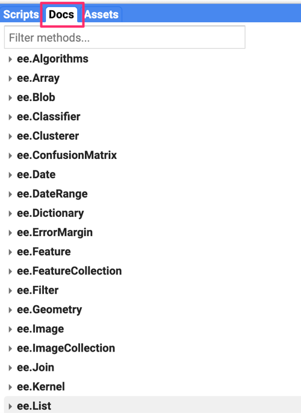
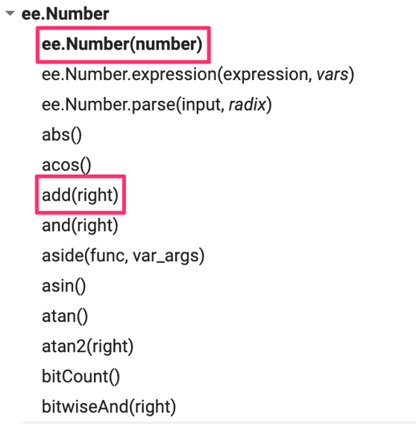
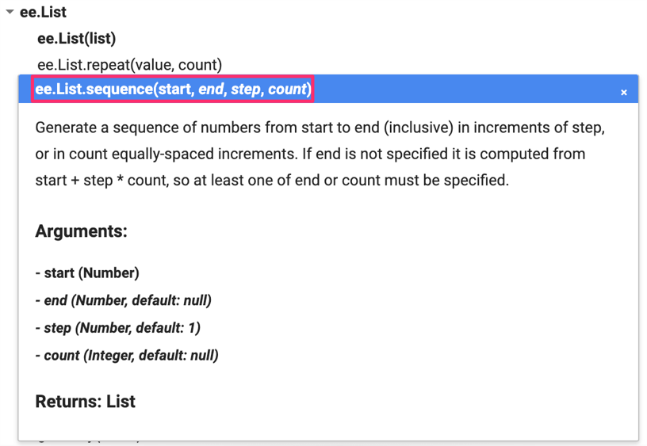
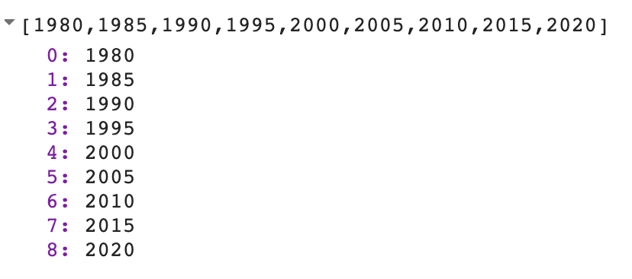
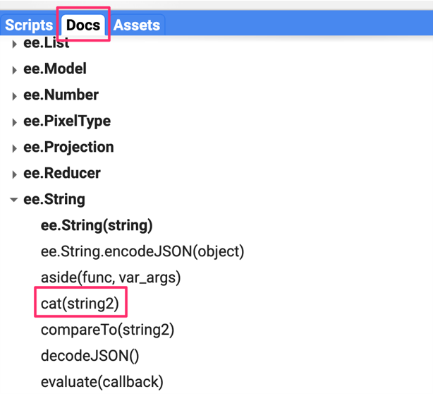

# Overview
In this module, you will learn how to utilize the extensive EE API function library to accomplish some fundamental programming tasks.

## Earth Engine API Basics
The Earth Engine API is vast and provides objects and methods to do everything from simple math to advanced algorithms for image processing. In the Code Editor, you can switch to the **Docs** tab to see the API functions grouped by object types. The API functions have the prefix `ee` (for Earth Engine).



Let’s learn to use the API. Suppose you want to add two numbers, represented by the variables a and b , as below. Make a new script and enter the following:

```javascript
var a = 1;
var b = 2;
```

In Sect. 1, you learned how to store numbers in variables, but not how to do any computation. This is because when you use Earth Engine, you do not do addition using JavaScript operators. For example, you would not write “var c = a + b” to add the two numbers. Instead, the Earth Engine API provides you with functions to do this, and it is important that you use the API functions whenever you can. It may seem awkward at first, but using the functions, as we’ll describe below, will help you avoid timeouts and create efficient code. 

Looking at the **Docs** tab, you will find a group of methods that can be called on an `ee.Number`. Expand it to see the various functions available to work with numbers. You will see the `ee.Number` function that creates an Earth Engine number object from a value. In the list of functions, there is an add function for adding two numbers. That’s what you use to add a and b.



To add a and b, we first create an `ee.Number` object from variable a with `ee.Number(a)`. And then we can use the `add(b)` call to add the value of b to it. The following code shows the syntax and prints the result which, of course, is the value 3. 

```javascript
var result = ee.Number(a).add(b);
print(result);
```

By now you may have realized that when learning to program in Earth Engine, you do not need to deeply learn JavaScript or Python—instead, they are ways to access the Earth Engine API. This API is the same whether it is called from JavaScript or Python. 

Here’s another example to drive this point home. Let’s say you are working on a task that requires you to create a list of years from 1980 to 2020 with a five-year interval. If you are faced with this task, the first step is to switch to the **Docs** tab and open the `ee.List` module. Browse through the functions and see if there are any functions that can help. You will notice a function `ee.List.sequence`. Clicking on it will bring up the documentation of the function.



The function `ee.List.sequence` is able to generate a sequence of numbers from a given start value to the end value. It also has an optional parameter step to indicate the increment between each number. We can create a `ee.List` of numbers representing years from 1980 to 2020, counting by 5, by calling this predefined function with the following values: `start = 1980`, `end = 2020`, and `step = 5`.

```javascript
var yearList = ee.List.sequence(1980, 2020, 5);
print(yearList);
```

The output printed in the **Console** will show that the variable `yearList` indeed contains the list of years with the correct interval.



You just accomplished a moderately complex programming task with the help of Earth Engine API. 

**Assignment 1.** 
Suppose you have the following two string variables defined in the code below. Use the Earth Engine API to create a new string variable called result by combining these two strings. Print it in the **Console**. The printed value should read “Sentinel2A.” 

```javascript
var mission = ee.String('Sentinel');
var satellite = ee.String('2A');
```

*Hint*: Use the `cat` function from the `ee.String` module to “concatenate” (join together) the two strings. You will find more information about all available functions in the **Docs** tab of the Code Editor. 



**Conclusion**

This chapter introduced the Earth Engine API. You also learned the basics of JavaScript syntax to be able to use the API in the Code Editor environment. We hope you now feel a bit more comfortable starting your journey to become an Earth Engine developer. Regardless of your programming background or familiarity with JavaScript, you have the tools at your disposal to start using the Earth Engine API to build scripts for remote sensing analysis.

Code Checkpoint: [https://code.earthengine.google.com/589d033b45da66080f1eba5f97be6cc9](https://code.earthengine.google.com/589d033b45da66080f1eba5f97be6cc9)