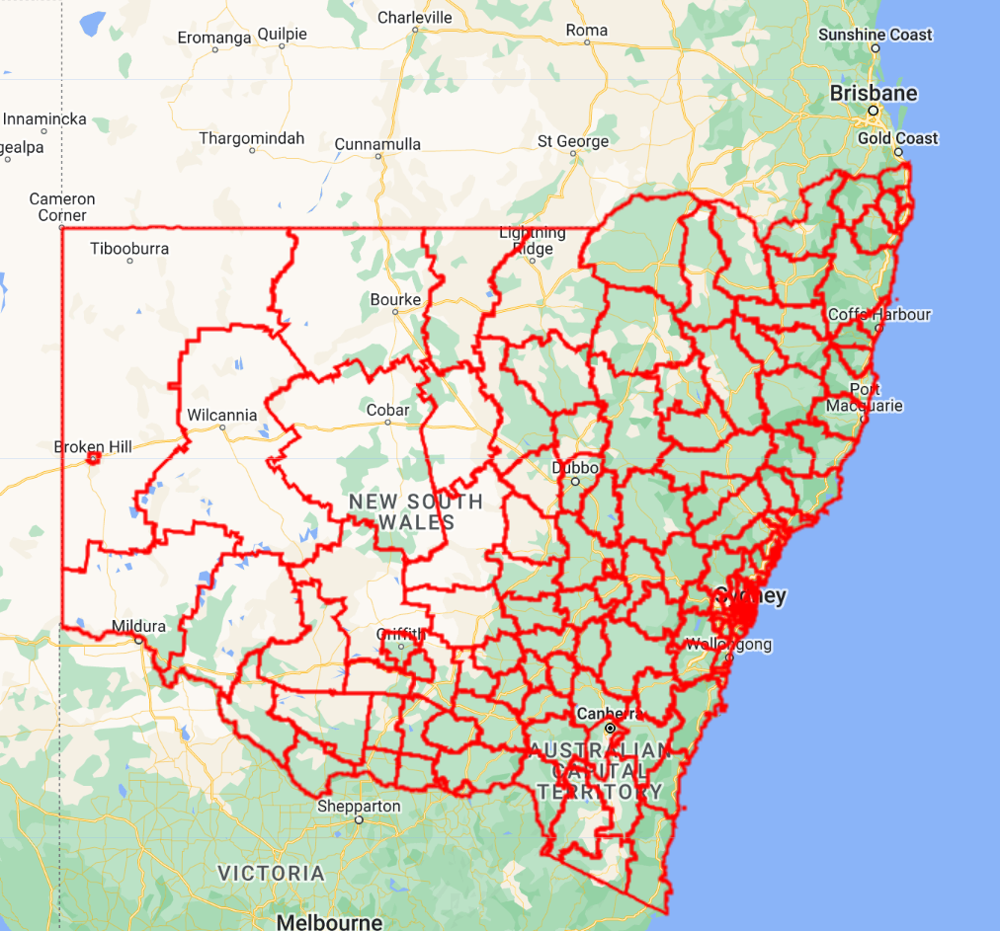
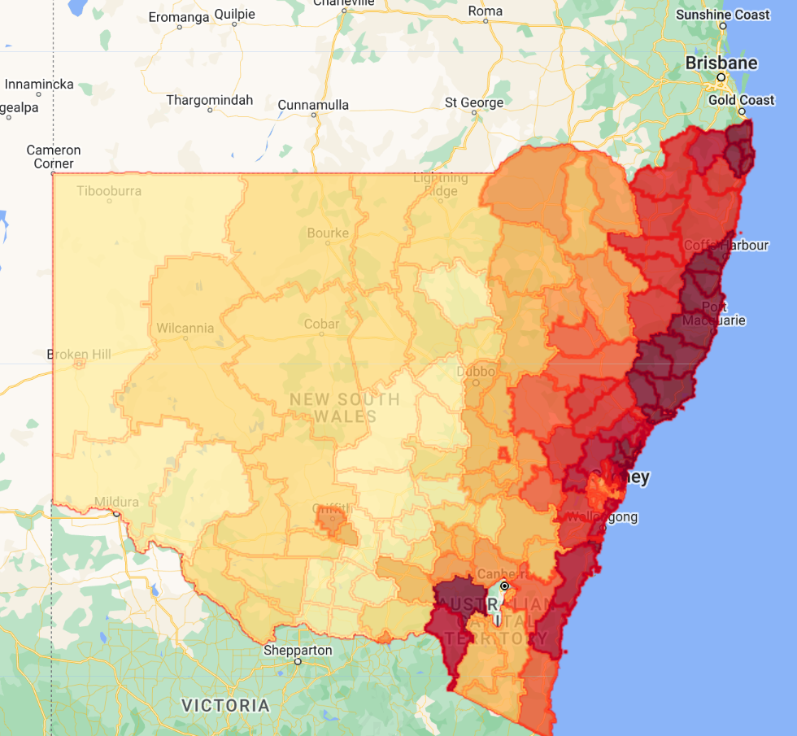

# Overview
In this module you will learn how to access and explore FeatureCollections in Earth Engine's data catalog, visualize them using style parameters, and practice some common analytics workflows.

## Before You Start

The GEE community of developers have contributed many utility packages. We will use one of these packages for FeatureCollection visualization. When you click this link, the GEE Code Editor will open and the package (a Code Editor script repository with importable functions) will be added to your own script repository under 'Reader':

Click this link: [https://code.earthengine.google.com/?accept_repo=users/gena/packages](https://code.earthengine.google.com/?accept_repo=users/gena/packages)


## Import Required Packages
```javascript
var style = require('users/gena/packages:style')
var palettes = require('users/gena/packages:palettes')
```

## Visualizing Admin Boundary Feature Collection

Let's use the FAO GAUL Administrative Boundary Layer Level 2 Dataset (`FAO/GAUL_SIMPLIFIED_500m/2015/level2`) and filter the features down to an Admin Level 1 entity that we care about.

```javascript
Map.setCenter(148,-32,6)

// Admin Level 2 bounds of NSW
var adm2 = ee.FeatureCollection("FAO/GAUL/2015/level2")
.filter(ee.Filter.eq('ADM1_NAME','New South Wales'))

// .style() featureCollections to control visualization
var styled = adm2.style({
  color:'red',
  width:2,
  fillColor:'00000000' // RRGGBBOO (Red Green Blue Opacity, 2 digits each)
})

Map.addLayer(styled,{},'adm2')

```



## Zonal Stats

We want to compute some summary statistic of a raster dataset within each administrative boundary. We'll use the Actual Evapotranspiration for Australia (`TERN/AET/CMRSET_LANDSAT_V2_2`). This dataset provides monthly averaged evapotranspiration from Landsat observations. Each image is a monthly average observation of ET, as we can see by the `print()` statement in the below code block. 

```javascript
// Evapotranspiration monthly time series for AUS 
var et = ee.ImageCollection("TERN/AET/CMRSET_LANDSAT_V2_2")
print(et.limit(12,'system:index',false)) // most recent 12 images
```

Goal: We want to see how each ADM2 boundary's Evapotranspiration compares to one another in a given month of a given year. 

We define an in-line function within a `.map()` to say 'For every monthly average ET observation (image in the ET collection), give me the mean ET value for each of my ADM2 features'. 

The result is the same ADM2 FeatureCollection, but with an additional property 'ETa' that contains the new zonal statistic value (e.g. 'mean') from the ET image. 

Using some additional visualization packages (installed before you ran the script), you can style the ADM2 FeatureCollection to visualize the 'Eta' property following a color palette, the same way we could do in common desktop GIS software. 

We are only visualizing results from time step 1 (the very first ET image in the collection).

```javascript
// Zonal Stats - average ET per ADM2 zone per ET time point
var etStats = et.map(function(i){
  var img = ee.Image(i)
  var zoneStats = img.reduceRegions(adm2,ee.Reducer.mean(),30);
  return zoneStats
})

var time1 = ee.FeatureCollection(etStats.first())
print(time1.limit(5))

// Display ADM2 features styled on ETa average value
var palette = palettes.cb.YlOrRd[9]
var hist = style.Feature.histogram(time1, 'ETa', { palette: palette, pointSize: 2, width: 0, opacity:0.75 })
Map.addLayer(hist, {}, 'time1 styled')
```




## Export Two Ways: Google Drive & BigQuery

Finally, you want to get the zonal statistics information out of GEE. You have several options. Two popular ones are Google Drive (as a CSV or Shapefile) and BigQuery.

We will only export for time step 1 to keep as a toy example, but operationalizing this doesn't require much more code. 

```javascript
// Export to Google Drive [CSV]
//Export.table.toDrive(collection, description, folder, fileNamePrefix, fileFormat, selectors, maxVertices)
Export.table.toDrive({
  collection:time1,
  description:'export_stats_to_csv',
  folder:'sig-gee-featureCollection-demo',
  fileNamePrefix:'etStats',
  fileFormat:'CSV'
});

// Export to BigQuery
// Export.table.toBigQuery(collection, description, table, overwrite, append, selectors, maxVertices)
Export.table.toBigQuery({
  collection:time1,
  description:'export_stats_to_bq',
  table:'sig-ee-cloud.fcdemo.et_stats', // need to make the BQ dataset first, it will make the table for you
})
```

Code Checkpoint: [https://code.earthengine.google.com/091e8bd88c897c0c8b59ad3a1d7dc6f9](https://code.earthengine.google.com/091e8bd88c897c0c8b59ad3a1d7dc6f9)