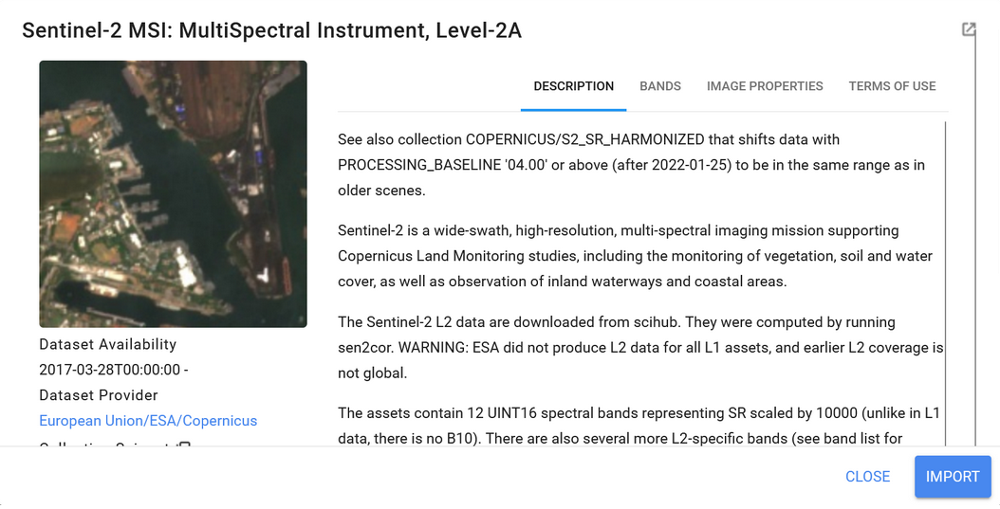
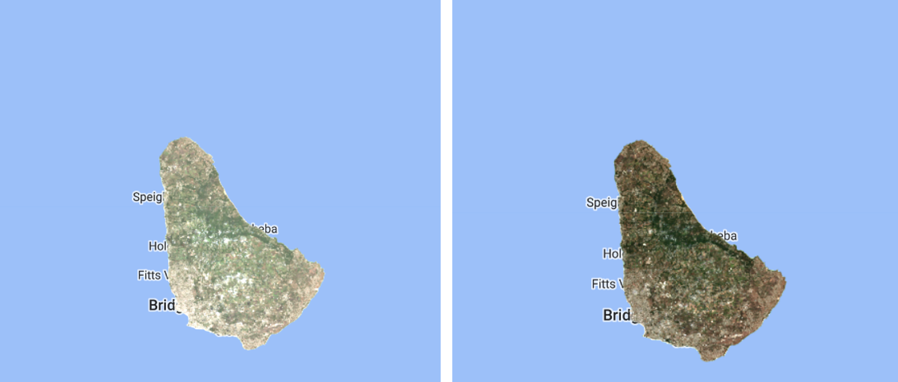

# Processing and cloud masking of composites over Sentinel data

*Keep the script from the previous section 'Processing and Cloud Masking Landsat' open, we will continue for this section*

In this exercise we will do a similar job than in the previous training but with Sentinel data. Now let’s import the Copernicus Sentinel-2 MultiSpectral Instrument (MSI) data collection. In the search bar we type *'sentinel-2'* and we can find a list of different datasets available. We select the level 2-A product which provides surface reflectance (SR) values.



Figure 21. Sentinel 2A dataset description

We name the dataset ‘*sentinel2_sr*’ and apply the corresponding temporal, spatial and spectral filters. First we define a cloud masking function. We have used a predefined cloud-masking function described in the GEE sentinel dataset catalog (https://developers.google.com/earth-engine/datasets/catalog/COPERNICUS_S2_SR).

```javascript
function maskS2clouds(image) {
  var qa = image.select('QA60');

  // Bits 10 and 11 are clouds and cirrus, respectively.
  var cloudBitMask = 1 << 10;
  var cirrusBitMask = 1 << 11;

  // Both flags should be set to zero, indicating clear conditions.
  var mask = qa.bitwiseAnd(cloudBitMask).eq(0)
  .and(qa.bitwiseAnd(cirrusBitMask).eq(0));

  return image.updateMask(mask).divide(10000);
}
```

Then we apply the cloud masking function `maskS2clouds` to the sentinel dataset. The *'CLOUDY PIXEL PERCENTAGE'* property is also used and it is a very important tool to mitigate cloud contamination. This filter is applied along with the cloud masking process.

```javascript
var s2_sr_med = sentinel2_sr
.filterDate('2022-01-01', '2022-06-30')
.filterBounds(barbados_bou)
.filter(ee.Filter.lt('CLOUDY_PIXEL_PERCENTAGE',20))
.map(maskS2clouds)
.median()
.select('B2','B3','B4','B5', 'B6', 'B7', 'B8', 'B8A', 'B11', 'B12')  // B 'B2', G 'B3', R 'B4', NIR 'B8'
.clip(barbados_bou);

// visualization sentinel 2
var visual_sen = {  //{bands: ['B4', 'B3','B2'], min: 0, max: 2000, gamma: 11}
  min: 0,
  max: 0.3,  // or 3000 if it's factored by default per 10000
  bands: ['B4', 'B3', 'B2'],
};

Map.addLayer(s2_sr_med,  visual_sen, "true color sentinel", 1);
```

The true color layer of the Sentinel 2A dataset median estimate is shown in Figure 22.


Figure 22. True color of median estimate for Sentinel time series from 01-2022 to 06-2022

The image from 2022 shows the presence of whitish pixels that correspond to lower cloud layers. For exercise purposes, let’s change the time period to 01-2020 to 06-2020. Also we can vary the cloud percentage allowed to compare between products.



Figure 23. Comparing different levels of cloud tolerance

The obstacle of cloudiness presence is major in the tropics. If you test this cloud masking procedure in other higher latitude regions then you might find less cloudy scenes. The tiles missing (gaps) correspond to images that did not pass the cloud percentage filter.

Code Checkpoint: [https://code.earthengine.google.com/fdc744c552d1f0c23039de42dcfdfc21](https://code.earthengine.google.com/fdc744c552d1f0c23039de42dcfdfc21)