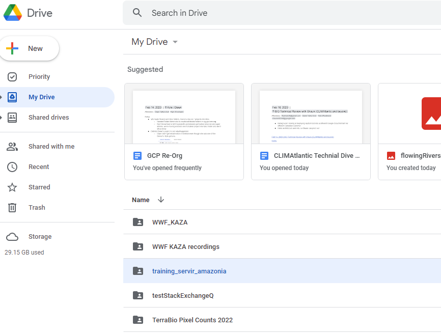

# Exporting hydrologic datasets

*Keep the previous script open from 'Retrieving and Visualizing Elevation Data', we will continue in this section*

In this exercise we learn how to export a dataset with appropriate parametrization in order to be loaded and utilized in another platform.  There exist plenty of water resources data collections available in the GEE catalog, however we will look for river information. The World WildLife Fund (WWF) has developed the HydroSHEDS Free Flowing Rivers Network in partnership with the U.S. Geological Survey, the International Centre for Tropical Agriculture, The Nature Conservancy, and the Center for Environmental Systems Research of the University of Kassel, Germany. This dataset provides hydrographic data at regional and global scales including information of river networks, watershed boundaries, drainage directions, and flow accumulations. Let’s type in the catalog search bar ‘flowing rivers’:


Figure 35. Looking for flowing rivers datasets


Figure 36. HydroSHEDS Free Flowing Rivers Network description.

Let’s import it and name it as 'rivers', and apply the spatial and temporal filters.  It’s important to notice this information corresponds to February 2000 as it can be read in the description. 

```javascript
//River information
var flowingRivers = ee.Image().byte().paint(rivers, 'RIV_ORD', 2)
.clip(barbados_bou);

var riverVisParams = {
  min: 1,
  max: 10,
  palette: ['08519c', '3182bd', '6baed6', 'bdd7e7', 'eff3ff']
};

Map.addLayer(flowingRivers, riverVisParams, 'Free flowing rivers');
Map.addLayer(rivers, null, 'Rivers FeatureCollection', false);
```


Figure 37. HydroSHEDS clipped layer showing the river network in Barbados.

The layer named as ‘Rivers Feature Collection’ contains every single item of the dataset such as small tributaries and minor rivers. Now let’s do a zoom over the capital city. We are able to see the scale of visualization by using the scale bar in the lower right corner as it is circled and pointed out in Figure 38.  Let’s leave only the hydrosheds and true color sentinel layers activated.


Figure 38. Rivers over Sentinel 2A mosaic can show the geographical match of the layers

*Tip*: You can deactivate the drawing of any layer you add by using `false` or `0` in the 4th argument place of `Map.addLayer()`.

```javascript
Map.addLayer(cloud_mask, {}, 'cloud mask', false);
Map.addLayer(l8_sr_cloud_masked.median(), visual_lan, 'image cloud masked', 0);
```

Now let’s export this dataset using the function *Export*. Something very important is to keep the visor panel large enough for our intended to be exported region or study area. The larger your study region the longer will be the Export request task. One additional step you could do is to draw a polygon of a smaller area of interest within the Barbados territory.  You can check this optional step in the general script link.

```javascript
Export.image.toDrive(
{
  image: flowingRivers,
  description: 'flowingRiversBarbados',
  folder:'training_servir_amazonia',    
  maxPixels:1e13
  }
);
```

We will find all the Export processes in the panel of Tasks.


Figure 39. Export tasks panel.


Figure 40. Export parametrization.


We might find errors like this *“Error: Pixel type not supported: Type\<Long>\. Convert the image to a floating point type or a smaller integer type, for example, using ee.Image.toDouble(). (Error code: 3)”*. This can happen when the datasets come in deprecated, old or very specific number formats.  We just have to apply a cast to our data to the traditional JS number formats like Float or Double. 

```javascript
Export.image.toDrive(
{
  image: ee.Image(flowingRivers).toDouble(),
  description: 'flowingRiversBarbados',
  folder:'training_servir_amazonia',    
  maxPixels:1e13
  }
);
```

In order to check the progress of the Export task, look at the task manager website by click on the link:


Figure 41. Task being exported.


Figure 42. Task manager

In order to find our exported products we have to go to the Google Drive site that belongs to the same gmail account used to log in into GEE



Figure 43. Google Drive folder that stores the exported products.

We will find one or more geotiff (.tiff) files depending on the size of our study area.


Figure 44. Exported raster into two geotiff files.

Once the exportation has finished we can download the data and upload it in other platforms, for example, QGIS.


Figure 45. HydroShed River network raster loaded in QGIS.

Code Checkpoint: [https://code.earthengine.google.com/e88efbb87f7305ce33aff2d8abd263f7](https://code.earthengine.google.com/e88efbb87f7305ce33aff2d8abd263f7).