# Caribbean trainings page template

This repository is a template to set up a website on [`github-pages`](https://pages.github.com/) that hosts all the content (step-by-step instructions, slides, code, recordings, photos, etc) for training workshops.

:construction: Under Construction :construction:

:construction: Everything below this line is under construction and not final :construction:

## Configuration

The repository is configured according to the following structure:

```
repository (caribbean-trainings)
├── config.yml
├── README.md
├── index.md
├── _includes
│   ├── head_custom.html
│   ├── head.html
├── lesson1/day1 ("intro-to-gis")
│   ├── lesson1/day1.md ("intro-to-gis.md")
│   ├── introduction.md
│   ├── topic1.md
│   ├── topic2.md
│   ├── .....
├── lesson2/day2 ("intro-to-remote-sensing")
│   ├── lesson1/day1.md ("intro-to-remote-sensing.md")
│   ├── introduction.md
│   ├── topic1.md
│   ├── topic2.md
│   ├── .....
├── ..... (other lessons/days)
├── images
│   ├── lesson1/day1-images ("intro-to-remote-sensing-images")
│   │   ├── file.png ("reflected-energy-radiation.png")
│   │   ├── .....
│   ├── lesson2/day2-images
│   │   ├── .....
├── partners
├── resources
└── photos
```

github desktop and external editor

markdown 

repository vs website

## Setup Instructions

### Using this template

1. Click on `Use this template` and then `Create new repository` to create a new repository for your workshop. Select the location, name, and description of the repository as you desire.

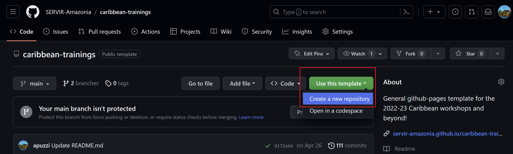

Alternative: If you are a member of the SERVIR-Amazonia repository, you can select it directly when creating a new repository:

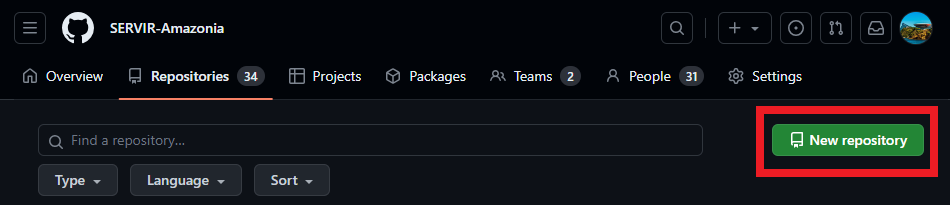

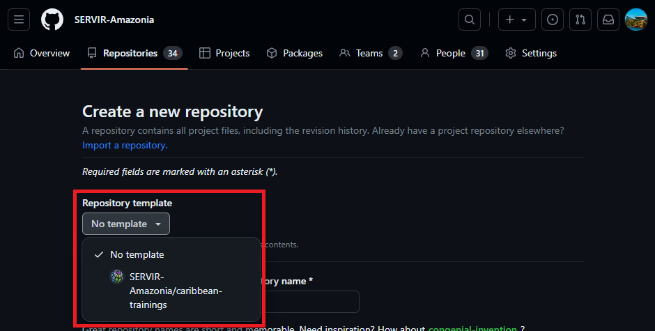

### Setting up the github-page

1. To set up the `github-pages`, in your new repository, go to `Settings` and then `Pages`. Select the branch you want to use for the website. Usually it is `main`.

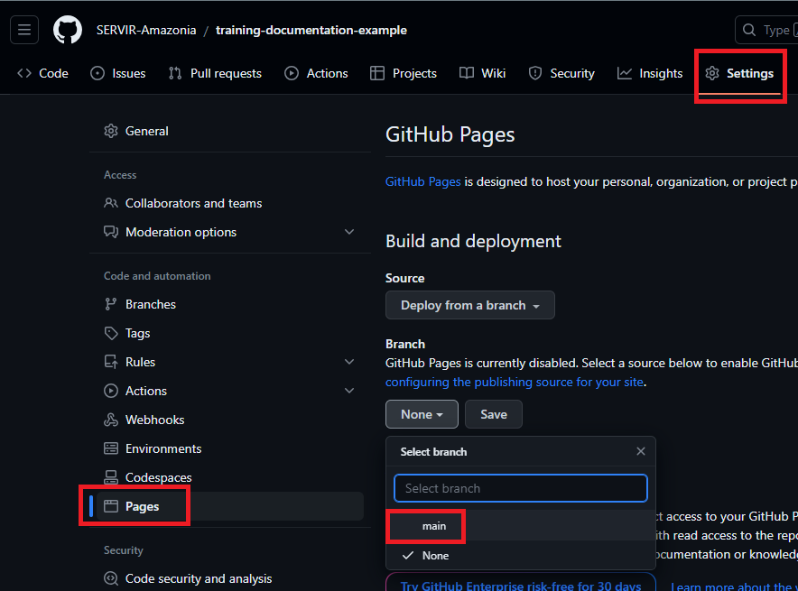

2. Then, hit `Save`.

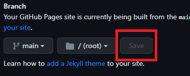

3. Go back to your repository's main page, and click on the gear icon next to `About` on the right side.

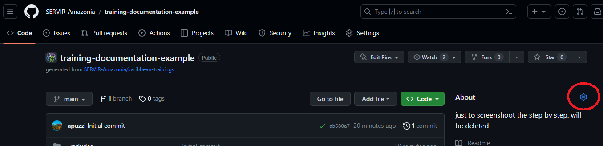

4. Under `Website`, check the option "Use your GitHub Pages website" and click on `Save changes`. Now you can see the URL on the repository's main page.

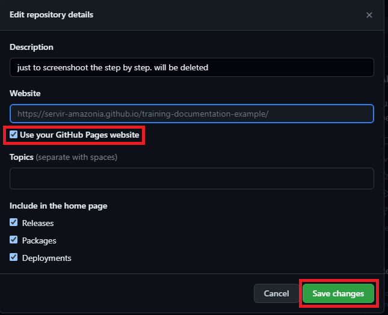

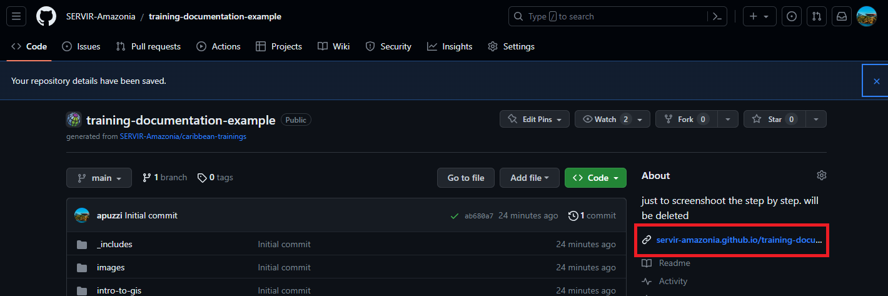

5. Open it to see how it looks like at this first moment. It will look like the `caribbean-trainings` page.

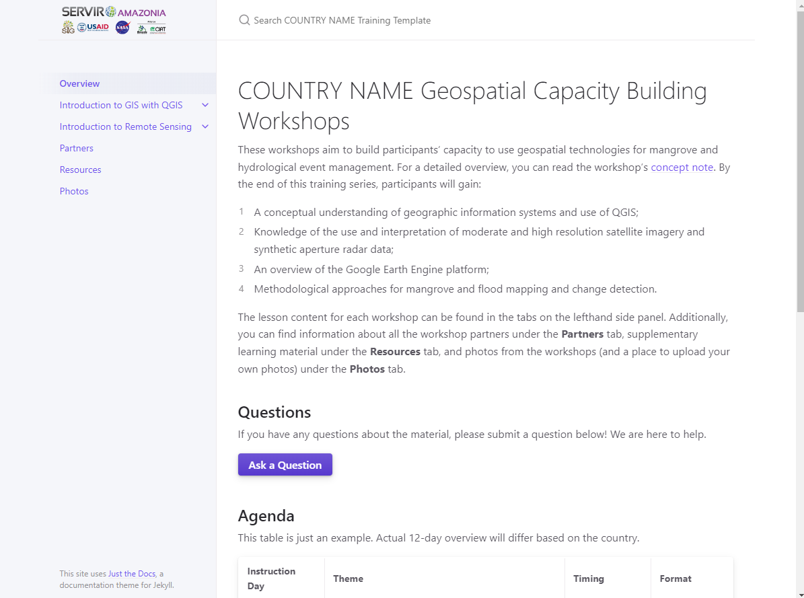

The following changes will reflect how your github page looks like.

### Customizing the repository to your training

1. Update the `README.md` file with the description of your repository.

2. Update the `config.yml` file with the details of your workshop. The changes here will reflect on the website.
    1. For `title`, add the title of your workshop
    2. For `description`, add a short description
    3. The `baseurl` is the subpath of your site, e.g.: `/NAME-OF-REPOSITORY`. Add the name of the repository so that it matches the website URL `https://servir-amazonia.github.io/NAME-OF-REPOSITORY`.
    4. The `url` is the base hostname & protocol for your site, `https://servir-amazonia.github.io`. You shouldn't change this unless the repository is not in the SERVIR-Amazonia github organization.
    5. For `logo`, you can add the name of a png file that contains the logo you desire. This file should be put under the `images` folder of your repository. Currently, the logo file is a png image that contains the SERVIR-Amazonia partners' logos. Don't change this if it is a SERVIR-Amazonia workshop.
    6. The `remote-theme` is the theme used for the github page. We use the Jekyll theme by `just-the-docs` but there are many more options. You can find more information about `just-the-docs` here: [https://just-the-docs.com/](https://just-the-docs.com/). Don't change this unless you are planning to use another theme. Note that using another theme may desconfigure the format of elements on the website.

3. Under the `_includes` folder, you will find two files. You don't need to worry about the `head.html` file. In the `head_custom.html` file, you can change the favicon that shows up next to the website description when you have the website open in a tab:


Currently, the file is SIG's favicon, but you can change it to your organization's favicon. To change it, update the file name in `href="images/favicon.ico"`. Note: you will need to add a new file containing the favicon in the `images` folder, or replace the existing `favicon.ico` file if you intend to use the same file name.

4. Got to the `index.md` file and update the title according to your country or workshop/training.

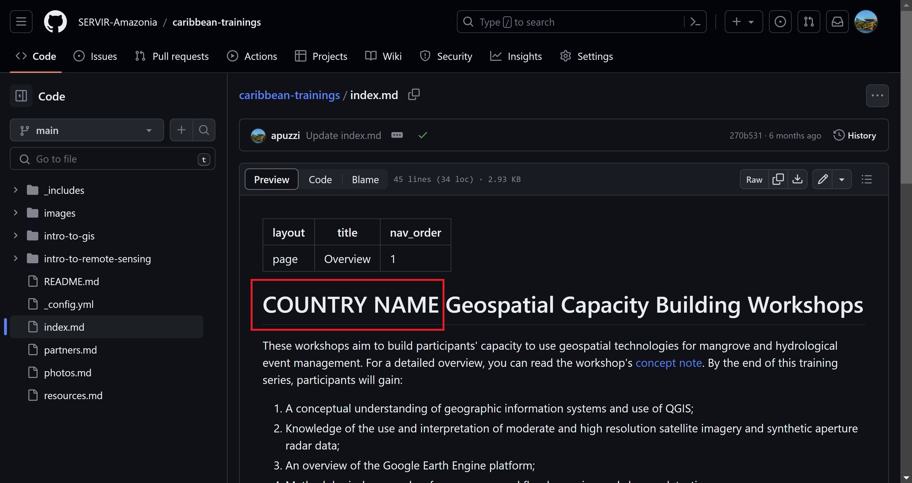

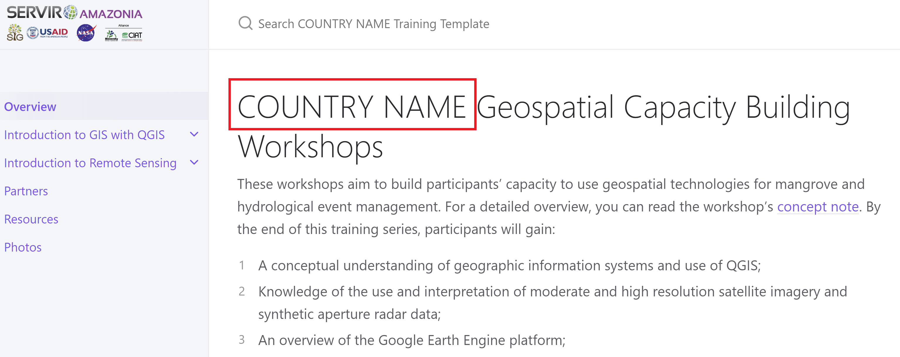

5. In the same `index.md` file, the `Questions`, `Feedback`, and `Workshop Recordings` sections are buttons that link into specific Google Forms or Drive folders. Update the URLs appropriately - you will need to create new Google forms and folders in your Drive folder.

e.g.: Update the https://forms.gle/8Jdm1aybL9sqzNEw6 URL in `[Give Feedback](https://forms.gle/8Jdm1aybL9sqzNEw6){: .btn .btn-purple }`.

6. You can use the [Tables Generator](https://www.tablesgenerator.com/markdown_tables) to update the workshop `Agenda` in the `index.md` file (easier when you have a table already, e.g. on a doc or spreadsheet): 

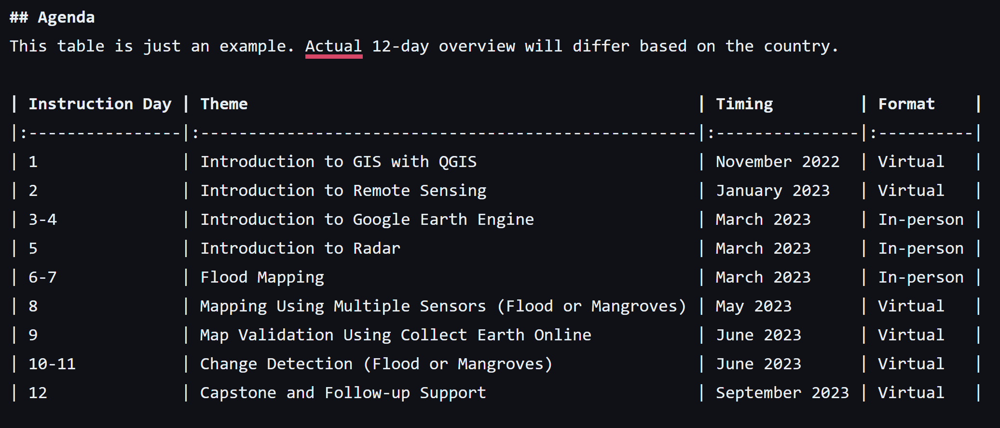

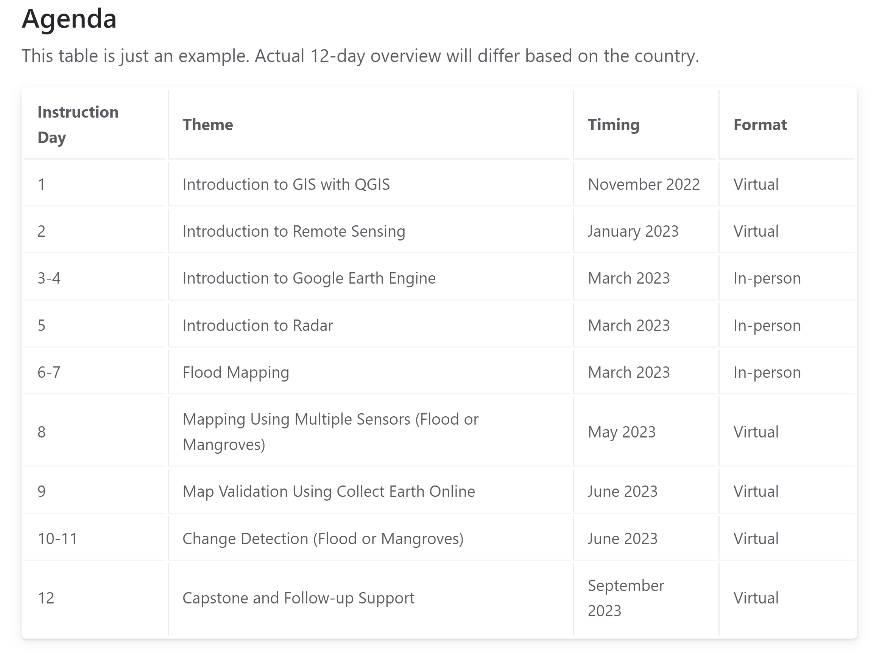

