# Prepare Data

# Create Area of Interest (AOI)

An area of interest can be uploaded from a local shapefile, drawn on the map, or derived from a pre-existing dataset in the Earth Engine catalogue.

For this exercise, we select a six regions from the Suriname `featureCollection` to be our AOI.  We are using these regions because they span a wide variety of land cover types for our classification.

```javascript
//--------------------------------------------------------------
// Import vector data (area of interest (AOI))
//--------------------------------------------------------------

// Import Suriname country boundary
var suriname = ee.FeatureCollection('projects/caribbean-trainings/assets/suriname-2023/boundary');

// Define regions we want as our AOI
var aoi = suriname
  .filter(ee.Filter.inList('DISTR_NM', ['Commewijne', 
                                        'Paramaribo', 
                                        'Wanica', 
                                        'Para', 
                                        'Saramacca', 
                                        'Brokopondo']));

// Add region features to the map
Map.addLayer(aoi, {}, 'Suriname AOI', false);

// Center the Map on the AOI, with a specified zoom-level 
// (between 1-24)
Map.centerObject(aoi, 8);
```

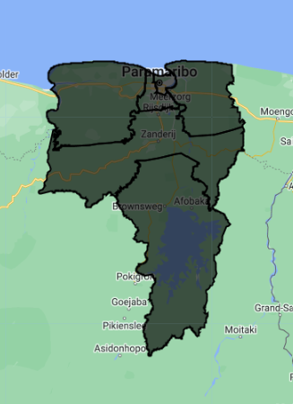

# Import Landsat Data

We create an an archive of Landsat imagery from Landsat missions 5 through 9, which allows us to compare any two years (or other time periods) between 1984 and 2023.  We are leaving out Landsat 7 because many scenes over Suriname have a distinctive striping pattern that is common in a lot of Landsat 7 data due to sensor errors (as you can see, Landsat 7 is commented out in the code).  

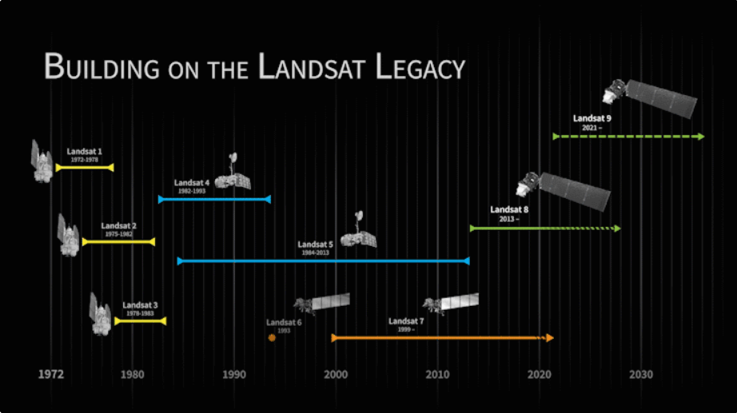

Before beginning a change detection workflow, image preprocessing is essential. The goal is to ensure that each pixel records the same type of measurement at the same location over time. These steps include multitemporal image registration and radiometric and atmospheric corrections, which are especially important. A lot of this work has already been automated and applied to many `ImageCollections` that are available in Earth Engine. Image selection is also important. Selection considerations include finding images with low cloud cover and representing the same phenology (e.g., leaf-on or leaf-off).

Landsat data comes in a variety of "Levels", "Collections", and "Tiers", based on data quality and preprocessing level.  We use Level 2, Collection 2, Tier 1, which is the highest quality data with the most preprocessing done on it.  This data set has pixel values that represent **surface reflectance**, meaning the proportion of incident radiation from the sun that is reflected back by objects on the surface of the earth.  This means that the reflectance values have been corrected for both radiometric (the sun's distance/angle to the earth) and atmospheric (the atmosphere's scattering/absorbtion of sunlight) distortions.  Surface reflectance is often preferred when comparing satellite imagery from different locations or dates, since atmospheric conditions can vary drastically between different images.

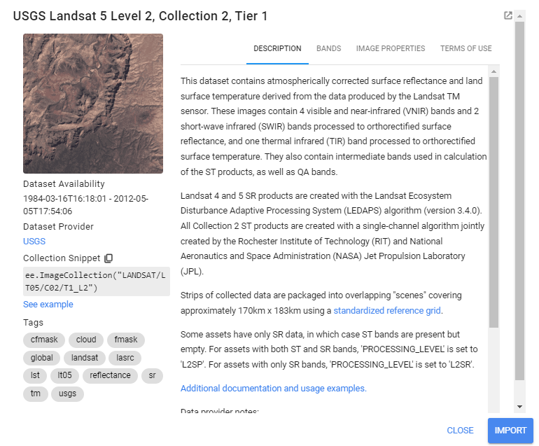

We always want to apply filters to `ImageCollections` as early in our workflow as we can to reduce the amount of effort the GEE servers will require. We already know the area that we'd like to pull data for our AOI, and that we want relatively few clouds in our images, so we apply a boundary and a cloud cover filter.

*Tip: Since there are differences in the amount and the order of bands on each Landsat mission, we use a dictionary (`sensorBandDictLandsatSR`) and a list (`bandNamesLandsatSR`) to standardize this information for us going forward using `select()` - it saves us quite a bit of typing when doing this for multiple collections.*

```javascript
//--------------------------------------------------------------
// Import raster data (Landsat 5-9)
//--------------------------------------------------------------

// Landsat -----------------------------------------------------

// Merge together all Landsat ImageCollections from 
// Landsat 5 - Landsat 9 to make a continuous archive of data 
// going back to the 1990s

// Each Landsat ImageCollection has slightly different ordering  
// of bands, so handling it with a dictionary saves us some typing

// Create a dictionary with the Landsat missions and their bands
var sensorBandDictLandsatSR = {'L9': ['SR_B2', 'SR_B3', 'SR_B4', 'SR_B5', 'SR_B6', 'SR_B7','QA_PIXEL'],
                               'L8': ['SR_B2', 'SR_B3', 'SR_B4', 'SR_B5', 'SR_B6', 'SR_B7','QA_PIXEL'],
                              // 'L7': ['SR_B1', 'SR_B2', 'SR_B3', 'SR_B4', 'SR_B5', 'SR_B7','QA_PIXEL'],
                               'L5': ['SR_B1', 'SR_B2', 'SR_B3', 'SR_B4', 'SR_B5', 'SR_B7','QA_PIXEL']}

// Create a list with the new band names
var bandNamesLandsatSR = ['blue', 'green', 'red', 'nir', 
                          'swir1', 'swir2','QA_PIXEL'] //// I took the 'QA_PIXEL' from here

// Create filter by max cloud cover % in a scene
var metadataCloudCoverMax = 25

// Get Landsat 5 as an ImageCollection
var lt5 = ee.ImageCollection('LANDSAT/LT05/C02/T1_L2')
    // select only the Landsat images that intersect with our AOI
    .filterBounds(aoi)
    // select only the Landsat images that have less than 
    // 25% cloud cover in the whole image
    .filter(ee.Filter.lt('CLOUD_COVER', metadataCloudCoverMax))
    .select(sensorBandDictLandsatSR['L5'], bandNamesLandsatSR);

// Landsat 7
// var le7 = ee.ImageCollection('LANDSAT/LE07/C02/T1_L2')
//     .filterBounds(aoi)
//     .filter(ee.Filter.lt('CLOUD_COVER', metadataCloudCoverMax))
//     .select(sensorBandDictLandsatSR['L7'], bandNamesLandsatSR)

// Landsat 8 
var lc8 = ee.ImageCollection('LANDSAT/LC08/C02/T1_L2')
    .filterBounds(aoi)
    .filter(ee.Filter.lt('CLOUD_COVER', metadataCloudCoverMax))
    .select(sensorBandDictLandsatSR['L8'], bandNamesLandsatSR);

// Landsat 9
var lc9 = ee.ImageCollection('LANDSAT/LC09/C02/T1_L2')
    .filterBounds(aoi)
    .filter(ee.Filter.lt('CLOUD_COVER', metadataCloudCoverMax))
    .select(sensorBandDictLandsatSR['L9'], bandNamesLandsatSR);
    
// Check one of the ImageCollections
print("Landsat 5 image collection:", lt5)
```

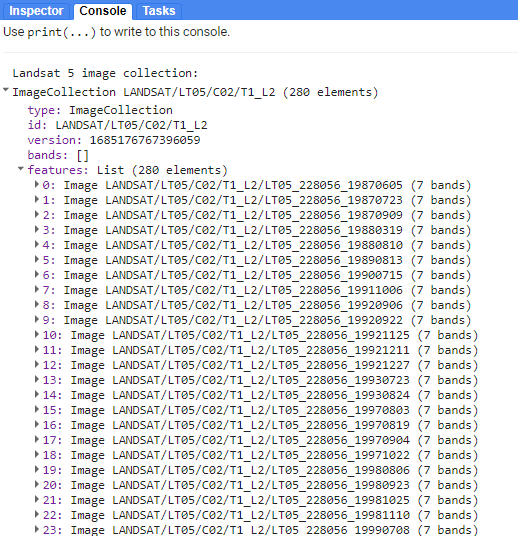

Checking in the **Console**, we see that `lt5` is an `ImageCollection` with 280 images in it. 

# Preprocess Landsat Data

Next, we apply some functions to each Landsat scene in a collection. 

In the first function, we mask clouds and cloud shadows using the `QA_PIXEL` band that is included in every Landsat scene. The `QA_PIXEL` band is a bitmask generated in the Landsat processing center before it is distributed to the end-user. It has a lot of useful information contained in it. We use the `cloud` and `cloud shadow` bits for this function.

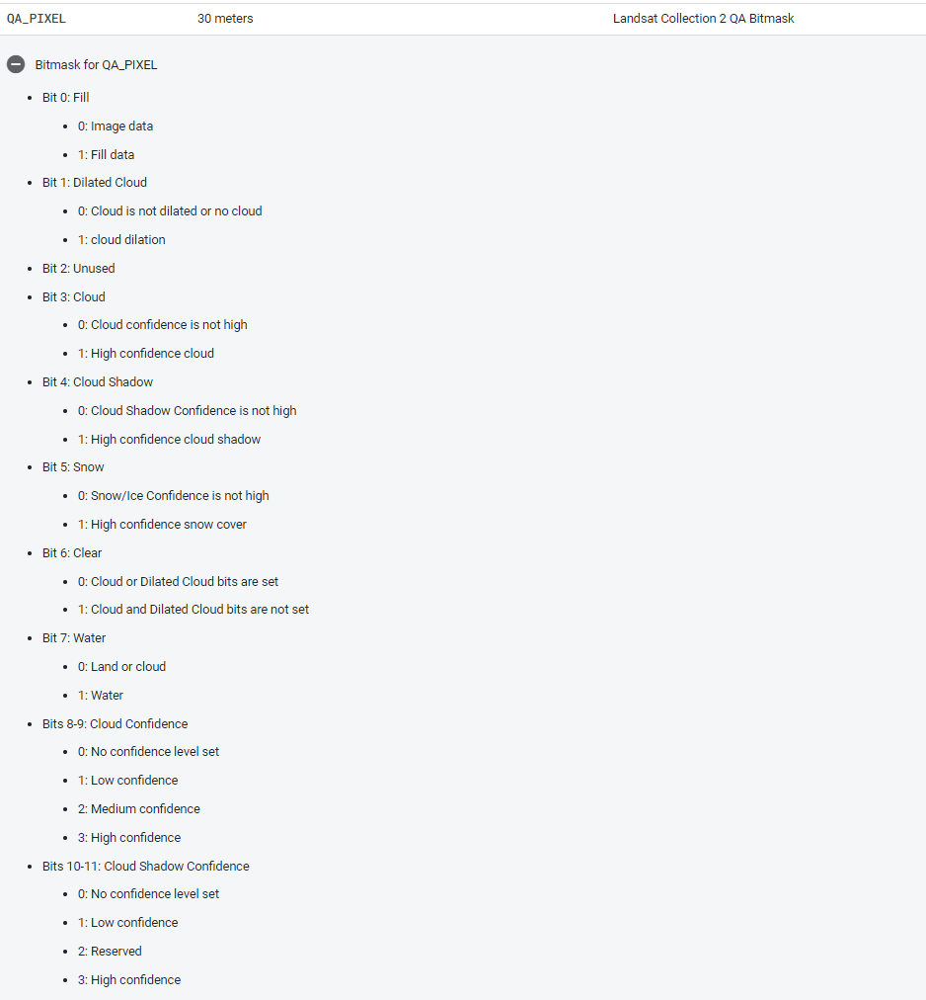

``` javascript
//--------------------------------------------------------------
// Preprocess Landsat images (cloud masking and index calculating)
//--------------------------------------------------------------

// We do time series preprocessing, which uses functions that 
// are applied to every image of the collection at once

// Create a cloud masking function
function cloudShadowMask(image) {
  // Select the correct bits
  // (bit 3 is cloud, bit 4 is cloud shadow)
  var cloudShadowBitMask = (1 << 4);
  var cloudsBitMask = (1 << 3);
  // Select the pixel QA band that the data is stored in
  var qa = image.select('QA_PIXEL');
  // Set both bit flags equal to zero, indicating clear conditions
  var mask = qa.bitwiseAnd(cloudShadowBitMask).eq(0)
            .and(qa.bitwiseAnd(cloudsBitMask).eq(0));
  return ee.Image(image).updateMask(mask);
}
``` 

In the second function, we scale the pixel values from digital numbers to true surface reflectance values.  Digital numbers are just an easier way to store data, and they need to be transformed into float values with meaningful units.  The new scaled values are between 0 and 1, representing reflectance (% of sunlight reflected).

``` javascript
// Create a function to apply scaling factors
// The reflectance values will be from 0 to 1 in all bands,
// so min and max visualization values will change
function applyScaleFactors(image) {
  // select and apply scaling factor to optical bands
  var opticalBands = image.select(bandNamesLandsatSR).multiply(0.0000275).add(-0.2);
  // add QA_PIXEL band back into data
  var qaBand = image.select('QA_PIXEL');
  return image.addBands(opticalBands, null, true)
              .addBands(qaBand, null, true);
}
```

In the third function, we generate several spectral indices from the pre-existing spectral bands that might be useful for distinguishing between different land cover classes. The indices are added as new bands to each image.  In the indeces we are using, the difference of the variables divided is by their sum.  This is referred to as a **normalized difference** equation, and the resulting value will always fall between −1 and 1.  First, we calculate the indices using the built-in `normalizedDifference()` function. Then, rename each image band with the built-in `rename()` function.

Working with indices known to highlight the land cover conditions before and after a change event of interest is a good starting point for any change detection workflow. For example, the Normalized Difference Water Index is good for mapping water level changes during flooding events; the Normalized Burn Ratio is good at detecting soil brightness; and the Normalized Difference Vegetation Index is good for tracking changes in vegetation (although this index does saturate quickly). In some cases, using derived band combinations that have been customized to represent the phenomenon of interest is is best, such as using the Normalized Difference Fraction Index to monitor forest degradation.

- **NDVI:** Normalized Difference Vegetation Index - vegetation health/presence; quantifies vegetation by measuring the difference between near-infrared (which vegetation strongly reflects) and red light (which vegetation absorbs)

- **NDMI:** Normalized Difference Moisture Index - vegetation water content; determines vegetation water content (calculated as a ratio between the NIR and SWIR values)

- **MNDWI:** Modified Normalized Difference Water Index - open water; uses green and SWIR bands for the enhancement of open water features (diminishes built-up area features that are often correlated with open water in other indices)

Looking at the spectral curves of different objects, we can begin to pick out which bands (wavelengths) of light can be most useful in making indices that distinguish between these different objects.

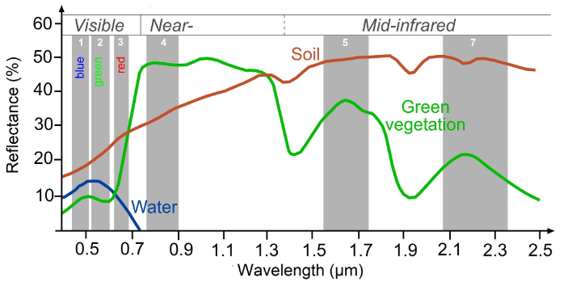

*Tip: Here is a great resource published by the University of Bonn for finding indeces for many different purposes: [https://www.indexdatabase.de/](https://www.indexdatabase.de/)*

``` javascript
// Create function to calculate these indices:
// NDVI: (NIR-Red)/(NIR+Red)
// MNDWI: (Green-SWIR2)/(Green+SWIR2)
// NDMI: (SWIR2-Red)/(SWIR2+Red)

// We use the GEE function normalizedDifference which does
// expressed as: (b1-b2)/(b1+b2)

function calculateIndices(img){
  // calculate the indices
  var ndvi = img.normalizedDifference(['nir', 'red']).rename('ndvi');
  var mndwi = img.normalizedDifference(['green', 'swir2']).rename('mndwi');
  var ndmi = img.normalizedDifference(['swir2', 'red']).rename('ndmi');
  // add these indices to the image as new bands
  var withIndices = img.addBands(ndvi).addBands(mndwi).addBands(ndmi);
  return withIndices
}
```

Now we apply the functions to every image in each Landsat collection using `.map()` and see the result.

``` javascript
// Apply pre-processing functions to each ImageCollection
// (cloud masking, scaling, index calculating)

var lt5_preprocessed = lt5.map(applyScaleFactors)
                          .map(cloudShadowMask)
                          .map(calculateIndices);
// var le7_preprocessed = le7.map(applyScaleFactors)
//                           .map(cloudShadowMask)
//                           .map(calculateIndices);
var lc8_preprocessed = lc8.map(applyScaleFactors)
                          .map(cloudShadowMask)
                          .map(calculateIndices);
                          
var lc9_preprocessed = lc9.map(applyScaleFactors)
                          .map(cloudShadowMask)
                          .map(calculateIndices);       

// Check the new bands in your ImageCollections
print("Bands:", lc9_preprocessed.first().bandNames())
```

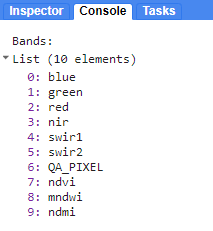

Let's add the first raw and first pre-processed Landsat 8 image to the map.  Toggle between the two image layers to see the result of the cloud masking fucntion. You can use **Inspector**  mode on each image in the map to see that the preprocessed image has a different set of spectral bands than the non-processed image.

``` javascript
//--------------------------------------------------------------
// Visualize a raw and pre-processed images
//--------------------------------------------------------------

// Select first raw image
var firstNonProcessed = lc8.first();

// Add image to map
Map.addLayer(firstNonProcessed, 
            {'bands': ['red', 'green', 'blue'],
            'min': 7000,
            'max': 12000}, 
            'First raw LC8 image', false);

// Select first pre-processed image
var firstPreProcessed = lc8_preprocessed.first();

// Add image to map
Map.addLayer(firstPreProcessed, 
            {'bands': ['red', 'green', 'blue'],
            'min': 0,
            'max': 0.2}, 
            'First pre-processed LC8 image', false);
```

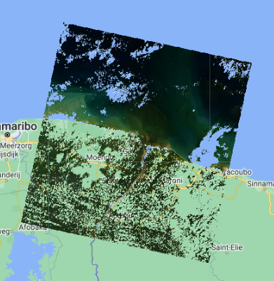

# Composite Landsat Data

Now, let's merge our preprocessed Landsat `ImageCollection`s into one. We will have a single `ImageCollection` consisting of data from multiple Landsat sensors for our area and date range of interest. 

Then, we need to choose two specific date ranges with which we'll train our land cover classification models. We also need to reduce the size of our input data by making a composite of the `ImageCollection` for each date range and clipping it to our AOI.

Right now, we will look at 2015 and 2022.  We use the `.median()` function to select the median value for every pixel in that date range.  Median is the measure of central tendency that is most resistant to extreme outliers, which are a frequent occurrence due to errors in satellite data (extremely bright or dark pixels).  Try out the other aggregating functions.  How would these change the values and the meanings of your maps?

*Note:  At a given pixel in your composite, if every single image in your `ImageCollection` was masked in that location (due to preprocessing in our case), then the composite will also be masked there. This can be remedied by more nuanced preprocessing algorithms and filters for the `ImageCollection`, but this is beyond the scope of this demonstration.*

``` javascript
//--------------------------------------------------------------
// Composite Landsat data
//--------------------------------------------------------------

// Merge preprocessed Landsat collections together into one ImageCollection
var mergedLandsat = lt5_preprocessed
// .merge(le7_preprocessed)
.merge(lc8_preprocessed)
.merge(lc9_preprocessed)

// Check how many images are in your merged ImageCollection
print("Number of images in merged Landsat 5-9 archive:", mergedLandsat.size())

// Create a composite for year 1 ("pre")
var preImage = mergedLandsat
    // filter for the dates of interest
    .filterDate('2015-01-01', '2015-12-31')
    // get the median value of all the pixels
    .median()
    // clip the image to the AOI
    .clip(aoi);

// Create a composite for year 2 ("post")
var postImage = mergedLandsat
    .filterDate('2022-01-01', '2022-12-31')
    .median()
    .clip(aoi);

// Compare the different aggregation methods you can use for compositing: 
// .min(); .max(); .mean(); .median()
```

Before running any sort of change detection analysis, it is useful to first visualize your input images to get a sense of the landscape, visually inspect where changes might occur, and identify any problems in the inputs. Here, we visualize both true-color and false-color NIR composites.

False-color composites draw other bands from multispectral sensors in the red, green, and blue channels in ways that are designed to illustrate contrast in imagery. Below, we produce a false-color composite using NIR in the red channel, green in the green channel, and blue in the blue channel.  NIR false-color composites can help highlight vegetation and standing water because NIR is strongly absorbed by water and strongly reflected by plants.

Following the format in the code block below, first create a variable `visParamNIR` and `visParamtrue` to hold the display parameters, selecting the correct bands and defining the `min` and `max` values. After adding the composites to the map, click and drag the opacity slider on the image layers back and forth to view the changes between your two images. 

``` javascript
//--------------------------------------------------------------
// Visualize composited images
//--------------------------------------------------------------

// Define visualization parameters for NIR false-color imagery
var visParamNIR = {
    'bands': ['nir', 'green', 'blue'],
    'min': 0,
    'max': 0.4
};

// Define visualization parameters for true-color imagery
var visParamtrue = {
    'bands': ['red', 'green', 'blue'],
    'min': 0,
    'max': 0.2
};

// Add images to the map
Map.addLayer(preImage, visParamNIR, 'Year 1 - false color NIR', false);
Map.addLayer(postImage, visParamNIR, 'Year 2 - false color NIR', false);
Map.addLayer(preImage, visParamtrue, 'Year 1 - true color', false);
Map.addLayer(postImage, visParamtrue, 'Year 2 - true color', false);

```

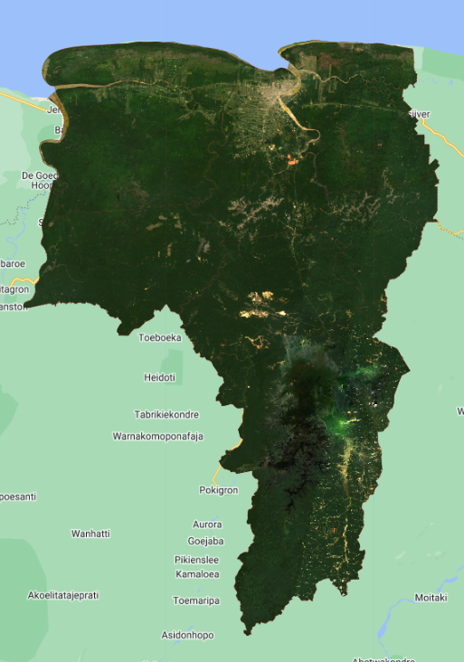

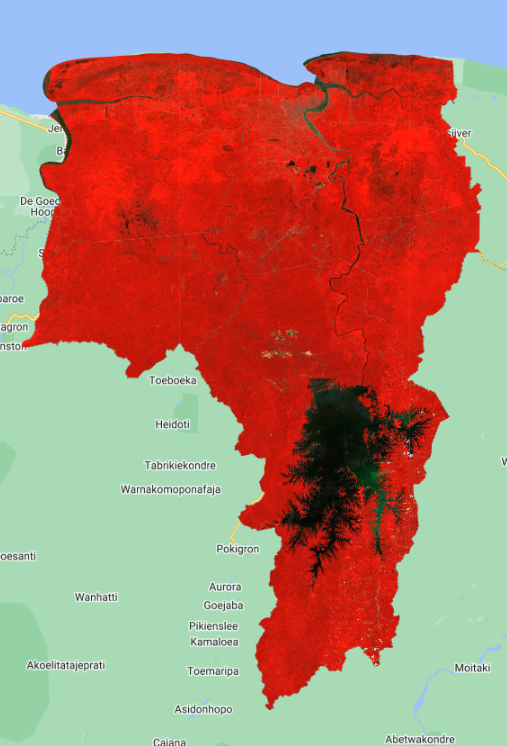

# Create Training Data 

To run a supervised classification like Random Forest, we must collect reference data to "train" the classifier and validate the classification. This involves collecting representative samples of spectral data for each map class of interest.

Using the true color and false-color Landsat composites in your map, we draw representative polygons for several classes: Forest, Water, Urban, Agriculture, and Bare Soil.  **We draw two separate sets of polygons for each year, using ONLY the Landsat imagery from that specific year.**

*Tip: If you want to use the exact same polygons that I used, you can import them from my **Assets** here:*

*[Year 1](https://code.earthengine.google.com/?asset=users/ebihari/TrainingPolygonsY1Suriname)*
*[Year 2](https://code.earthengine.google.com/?asset=users/ebihari/TrainingPolygonsY2Suriname)*

*Type this into the code editor to import my polygons:*

``` javascript
// Import Eni's polygons from her Assets
var year1_FC = ee.FeatureCollection("users/ebihari/TrainingPolygonsY1Suriname");
var year2_FC = ee.FeatureCollection("users/ebihari/TrainingPolygonsY2Suriname");
```

Below is the workflow for creating reference data directly in Earth Engine. We will use `Forest_year1` as the example.

1. In the geometry drawing toolbar (top-left of the **Map** panel), go to **Geometry Imports** and click **new layer**.

    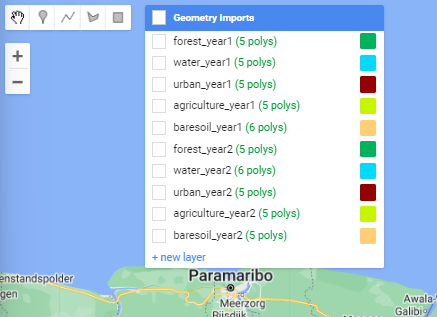

2. Click on the **Edit layer properties** button (cog icon next to the geometry's name) to configure the new geometry layer. Name the new layer `forest_year1` and change its color. Under **Import as**, change it to `FeatureCollection`. Finally, click on the **+ Property** button and enter a new property `landcover` with a value of `1`.  Each geometry layer, imported to your script now as a `FeatureCollection` will represent one class within your map product. 

    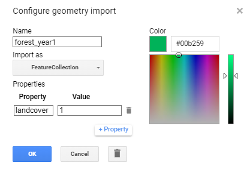

3. Draw representative polygons on the map. Click again on the geometry layer **forest_year1** in the **Geometry Imports** panel and ensure it shows up in **bold text**. Then click on the **draw a shape** icon. Draw your open water polygons. 

    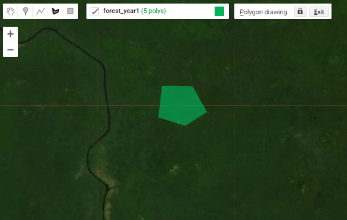

Repeat these steps for each of the remaining map classes for both years. To get through this demonstration, shoot for 3 or 4 large polygons or 7 or 8 smaller ones per class. We can refine the quality of our reference data later if we have time.  

*Note: Since each geometry layer represents its own map class, the value for the `landcover` property must change when you are at the configuration step. For example, use landcover value of 2 for the next geometry layer that you create and so on.*

Now that we have reference polygons for our map classes, we merge their `FeatureCollections` into one. Be mindful of the names that you gave to each polygon feature collection, as they need to be the same in the script as they are in the **Geometry Imports** panel.

``` javascript
//--------------------------------------------------------------
// Create training data
//--------------------------------------------------------------

// We make separate training data for Year 1 and Year 2
// (using the true color and false color images from each year)

// Draw small polygons over representative areas of each class:
// 1. forest
// 2. water
// 3. urban
// 4. agriculture
// 5. bare soil

// Merge training FeatureCollections 
// var year1_FC = forest_year1
//     .merge(water_year1)
//     .merge(urban_year1)
//     .merge(agriculture_year1)
//     .merge(baresoil_year1);
// var year2_FC = forest_year2
//     .merge(water_year2)
//     .merge(urban_year2)
//     .merge(agriculture_year2)
//     .merge(baresoil_year2);

// Add merged training FeatureCollections to map
// Map.addLayer(year1_FC, {}, "Year 1 - training polygons", false);
// Map.addLayer(year2_FC, {}, "Year 2 - training polygons", false);
```

Next, we use the merged `FeatureCollection` of reference polygons to extract the Landsat band and index values for each landcover to the pixels in those polygons. The polygons within the `year1_FC` and `year2_FC` `FeatureCollection`s are overlaid on the image, and each pixel is converted to a point containing the image's pixel values and the other properties inherited from the polygon (in our case `landcover` property). After you run this, note in the **Console** the total size of reference points we now have to train and validate our map. Since every single pixel in your polygons is converted into a point, if your polygons are too large, GEE might give you an error that you have run out of memory and you need to make your polygons smaller.

``` javascript
// extract Landsat bands and indices to the training polygons
// and create sample points
var samples_y1 = preImage.sampleRegions({
  collection:year1_FC,
  properties:['landcover'],
  scale:30});
var samples_y2 = postImage.sampleRegions({
  collection:year2_FC,
  properties:['landcover'],
  scale:30});

// Check how many sample points were created from your polygons
print('Sample size - year 1: ', samples_y1.size());
print('Sample size - year2: ', samples_y2.size());
```

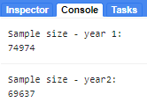

Then, we set aside 80% of the reference points to train our classifier, and use the remaining 20% for validation. We do this simply by adding a new column to the reference points called `random` (which contains random decimal numbers between 0 and 1) and then filtering them into the two groups (those greater than 0.8 and those smaller than 0.8).  This should give us about 80% of the points for training and 20% for testing.

``` javascript
//Split sample points into training and testing sets
var random_y1 = samples_y1.randomColumn();
var training_y1 = random_y1.filter(ee.Filter.lte('random',0.8));
var testing_y1 = random_y1.filter(ee.Filter.gt('random',0.8));
// Check how many points are in the training and testing sets
// print('Training size - year 1: ', training_y1.size());
// print('Testing size - year 1: ', testing_y1.size());

var random_y2 = samples_y2.randomColumn();
var training_y2 = random_y2.filter(ee.Filter.lte('random',0.8));
var testing_y2 = random_y2.filter(ee.Filter.gt('random',0.8));
// print('Training size - year 2: ', training_y2.size());
// print('Testing size - year 2: ', testing_y2.size());
```

We now finished importing, creating, and preprocessing our data sets.  Continue to the next section for running the land cover classifications and calculating land cover changes.

Code Checkpoint: [https://code.earthengine.google.com/2c32bf74f7a33dab9048e6b08944add2](https://code.earthengine.google.com/2c32bf74f7a33dab9048e6b08944add2)