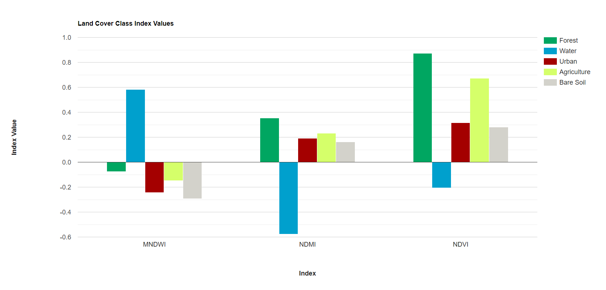

# Run Classification and Calculate Change

# Visualize Spectral Signatures

Before beginning our analysis, we quickly visualize the spectral signatures and index values of our representative polygons of different land cover classes.  We use Earth Engine's `ui.Chart` functionality to graph the median values of the bands and indices for each land cover class.  Do the spectral signatures look different between our 5 classes?  Are there any classes that are very similar to each other, and thus might be difficult to separate in our random forest model?

``` javascript
//--------------------------------------------------------------
// Visualize spectral signatures
//--------------------------------------------------------------

// Convert sample polygon featureCollection to an image
var year1_FC_image =
    year1_FC
        .reduceToImage({properties: ['landcover'], reducer: ee.Reducer.first()})
        .rename('landcover');

// Select the Landsat bands you want to display 
var preImage_forchart = preImage.select(['blue', 'green', 'red', 'nir', 'swir1', 'swir2'])
    // Add the sample polygons image bands on to the Landsat composite
    .addBands(year1_FC_image);

// Define the list of bands to be the x-axis labels 
//(based on wavelength in micrometers)
var bands = ['blue', 'green', 'red', 'NIR', 'SWIR1', 'SWIR2'];
var wavelenghts = [0.47, 0.56, 0.65, 0.86, 1.6, 2.2]

// Define the chart and print it to the console
var chart = ui.Chart.image
                .byClass({
                  image: preImage_forchart,
                  classBand: 'landcover',
                  region: year1_FC,
                  reducer: ee.Reducer.median(),
                  scale: 30,
                  classLabels: ['','Forest', 'Water', 'Urban', 'Agriculture', 'Bare Soil'],
                  xLabels: wavelenghts
                })
                //.setChartType('ScatterChart')
                .setChartType('ScatterChart')
                .setOptions({
                  title: 'Land Cover Class Spectral Signatures',
                  hAxis: {
                    title: 'Band Wavelength (µm)',
                    titleTextStyle: {italic: false, bold: true},
                    ticks: wavelenghts
                  },
                  vAxis: {
                    title: 'Reflectance',
                    titleTextStyle: {italic: false, bold: true}
                  },
                  colors: ['00a661','00a0cd','a40000', 'd5ff6a','d3d2cb'],
                  pointSize: 0,
                  lineSize: 2,
                  curveType: 'linear'
                });
print(chart);

// Select the Landsat indices you want to display 
var preImage_forchart2 = preImage.select(['ndvi', 'mndwi', 'ndmi'])
    // Add the sample polygons image bands on to the Landsat composite
    .addBands(year1_FC_image);

// Define the list of bands to be the x-axis labels
var bands2 = ['NDVI', 'MNDWI', 'NDMI'];

// Define the chart and print it to the console
var chart2 = ui.Chart.image
                .byClass({
                  image: preImage_forchart2,
                  classBand: 'landcover',
                  region: year1_FC,
                  reducer: ee.Reducer.mean(),
                  scale: 30,
                  classLabels: ['','Forest', 'Water', 'Urban', 'Agriculture', 'Bare Soil'],
                  xLabels: bands2
                })
                .setChartType('ColumnChart')
                .setOptions({
                  title: 'Land Cover Class Index Values',
                  hAxis: {
                    title: 'Index',
                    titleTextStyle: {italic: false, bold: true}
                  },
                  vAxis: {
                    title: 'Index Value',
                    titleTextStyle: {italic: false, bold: true}
                  },
                  colors: ['00a661','00a0cd','a40000', 'd5ff6a','d3d2cb']
                });
print(chart2);
```




# Run Random Forest Classification

We choose a classifier algorithm from `ee.Classifier` family of functions, and train it on the `training_y1` and `training_y2` `FeatureCollection`s with `train()`. We must specify the `classProperty` to be the property we want to map, or predict, with the model, and the `inputProperties` as the Landsat band and index values defined by the `predictionBands` variable. Then, we run the classifier on the `preImage` and `postImage` with `classify()`.

We use a Random Forest classifier, which puts each individual pixel through many decision trees (with some random element to them) that each place the pixel in one of our pre-defined classes based on the pixel's spectral similarity to our training points. The final class of the pixel will be the class that the majority of the decision trees gave that pixel.  We print out our decision trees to see how the classifier decided to categorize pixels based on their spectral values.


*Tip: Here is a short intro to how random forest classification works: [https://www.ibm.com/topics/random-forest](https://www.ibm.com/topics/random-forest)*

``` javascript
//--------------------------------------------------------------
// Run classification (Random Forest)
//--------------------------------------------------------------

// Define prediction bands
// (all Landsat image bands and indices except the QA band)
var predictionBands =  preImage.bandNames().remove('QA_PIXEL'); 
print('Prediction Bands:', predictionBands)

// Train the classifier with training points only
// "Call" the random forest classifier and train it with the training points
var RFclassifier_y1 = ee.Classifier.smileRandomForest({numberOfTrees:10, seed:100}).train({
  features: training_y1, 
  classProperty: 'landcover',
  inputProperties: predictionBands
});
var RFclassifier_y2 = ee.Classifier.smileRandomForest({numberOfTrees:10, seed:100}).train({
  features: training_y2, 
  classProperty: 'landcover',
  inputProperties: predictionBands
});

// Print decision trees
var decisionTrees_y1 = RFclassifier_y1.explain();
print('Decision Trees:', decisionTrees_y1);
var decisionTrees_y2 = RFclassifier_y2.explain();
print('Decision Trees:', decisionTrees_y2);

// Classify the median composite
var RFclassification_y1 = preImage
.select(predictionBands)
.classify(RFclassifier_y1);
var RFclassification_y2 = postImage
.select(predictionBands)
.classify(RFclassifier_y2);

// Define visualization parameters
// adjust colors according to your land cover stratification
// define visualization parameters
// 1 = forest; green
// 2 = water; blue
// 3 = urban; red
// 4 = agriculture; light green
// 5 = bare soil; grey
var classVis = {min:1,max:5,palette:['00a661','00a0cd','a40000', 'd5ff6a','d3d2cb']}

// Add classifications to the map
Map.addLayer(RFclassification_y1,classVis,'Year 1 - classification')
Map.addLayer(RFclassification_y2,classVis,'Year 2 - classification')
```
Display the results, and modify the color palette if needed.


Immediately, we can pick out where some features are mixed up between classes, and where the classifier excels. Which land cover classes seem to have been confused?  Do these land cover classes have similar spectral signatures based on our previous graphs?

# Run Accuracy Assessment

It is time to test our the accuracy of our model (RF Classifier). We will use the validation set of points for this. We will assess year 1's classifier with year 1's validation points. You can recycle this code to do it for year 2's model. 

```js
// classify year1 test set with year1 classifier trained on year1 training set
var classificationVal = testing_y1.classify(RFclassifier_y1);
print('year 1 Classified points', classificationVal.limit(5));

// Create confusion matrix.
var confusionMatrix = classificationVal.errorMatrix({
  actual: 'landcover', 
  predicted: 'classification'
});

// Print Confusion Matrix and accuracies.
print('year 1 Confusion matrix [Testing Set]:', confusionMatrix);
print('year 1 Overall Accuracy [Testing Set]:', confusionMatrix.accuracy());
```

We obtained 98% overall accuracy, which is very good. However, we just saw how the classification may vary quantitavively and qualitatively. Other parameters can be estimated to help with the interpretation of results, from an individual perspective. These are the producer and user accuracy. For example, in the image below (taken from Congalton & Green, 2009), the producer accuracy is estimated by dividing the total number of correct sample units in the "deciduous" category (i.e., 65) by the total number of deciduous sample units as indicated by the reference data (i.e., 75 or the column total). This division results in a “producer’s accuracy” of 87%, which is quite good. If we stopped here, one might conclude that although this classification appears to be average overall, it is more than adequate for the deciduous category. Drawing such a conclusion could be a very serious mistake. A quick calculation of the “user’s accuracy” is computed by dividing the total number of correct sample units in the "deciduous" category (i.e., 65) by the total number of sample units classified as deciduous (i.e., 115 or the row total) reveals a value of 57%. In other words, although 87% of the deciduous areas have been correctly identified as deciduous, only 57% of the areas called deciduous on the map are actually deciduous on the ground. The high producer’s accuracy occurs because too much of the map is labeled "deciduous".

<p align="center">

</p>

We can easily compute producers and users (also called consumers) accuracies with the below functions.

```js
print('year 1 Producers Accuracy [Testing Set]:', confusionMatrix.producersAccuracy());
print('year 1 Users Accuracy [Testing Set]:', confusionMatrix.consumersAccuracy());

// repeat above for year2 model accuracies
```

Which classes perform well? Which do not? Where do we have the worst comission error? Omission error? 

Keep in mind that in a real-world modelling exercise, we may choose to train a single model on a variety of data, then use that model to make inferences. Here we trained two separate models for two different years and two different reference datasets.

# Calculate Areas of Change

Now that we have two land cover classification maps for our two different years, we can calculate the areas of various land cover classes in each year see how those areas have changed.  We do this using `multiply()` and `sum()` to get the area of each pixel with the value of `1` in square meters, sum them all up, and convert them to square kilometers.

Here, we do this process just for our Forest class, but it can be done for all the other classes as well!

``` javascript
//--------------------------------------------------------------
// Calculate class areas
//--------------------------------------------------------------

// Define the pixel category that corresponds to forest
var areaForest_y1 = RFclassification_y1.eq(1).multiply(ee.Image.pixelArea());
var areaForest_y2 = RFclassification_y2.eq(1).multiply(ee.Image.pixelArea());

// Apply reducer to sum areas per pixel
var reducerAreaForest_y1 = areaForest_y1.reduceRegion({
  reducer: ee.Reducer.sum(),
  geometry: aoi,
  scale: 30,
  crs: 'EPSG:4326',
  maxPixels: 1e15
  });
var reducerAreaForest_y2 = areaForest_y2.reduceRegion({
  reducer: ee.Reducer.sum(),
  geometry: aoi,
  scale: 30,
  crs: 'EPSG:4326',
  maxPixels: 1e15
  });

// Convert m^2 to km^2
var areaSqKmForest_y1 = ee.Number(reducerAreaForest_y1.get('classification')).divide(1e6);
print('Forested Area - year 1 (km^2):',areaSqKmForest_y1);
var areaSqKmForest_y2 = ee.Number(reducerAreaForest_y2.get('classification')).divide(1e6);
print('Forested Area - year 2 (km^2):',areaSqKmForest_y2);
```


# Create Change Map

The last step classifying our image into a thematic map consisting of stable and change classes. This can be done rather simply by creating rules or thresholds based on the differences in land cover or index values. In the end, resources, timing, and the patterns of the phenomenon you are trying to map will determine which approach is suitable — or perhaps the activity you are trying to track requires something more advanced, such as a time-series approach that uses more than two dates of imagery.

Here, we create a map showing gains, losses, and stable areas of each land cover type.  We do this by writing a function that checks what whether the `landcover` was forest in both Year 1 and Year 2, and creates a new bands called `change` in which it labels the pixel as either loss, gain, or stable based on those original `landcover` values.

Here, we do this process just for our Forest class, but it can be done for all the other classes as well!

``` javascript
//--------------------------------------------------------------
// Create change map
//--------------------------------------------------------------

// Define which class you want to use (let's use forest first)
var landcover = 1;

// Create a function that creates a change map
var classifyChanges = function(image1, image2, landcover) {
    
    // create an empty image to use as a base for the change map
    var changeImage = ee.Image(0);
    
    // add a value of 1 to the image where land cover was stable
    changeImage = changeImage.where(image1.eq(landcover).and(image2.eq(landcover)), 1);
    // add a value of 2 to the image where land cover was gained
    changeImage = changeImage.where(image1.neq(landcover).and(image2.eq(landcover)), 2);
    // add a value of 3 to the image where land cover was lost
    changeImage = changeImage.where(image1.eq(landcover).and(image2.neq(landcover)), 3);
    
    // Return the land cover change image with a single band
    return changeImage.rename('change');
};

// Apply the function to the Year 1 and Year 2 classifictaion maps 
//  to get land cover changes between the two
var forestChange = classifyChanges(RFclassification_y1, RFclassification_y2, landcover);

// define visualization parameters
// 1 = stable; light green
// 2 = gain; dark green
// 3 = loss; red
var changeVis = {
    palette: ['e5ffd0','72ad00','c32148'],
    min: 1,
    max: 3 };

// Add change classification to map
Map.addLayer(forestChange.selfMask(),
    changeVis,
    'Forest cover change');
```


Where was forest gained or lost? Do you think some of these "changes" might just be due to errors in the data prep and classification process?

# Calculate Change Areas

Now, using the same process as before, we can calculate the area of each kind of change for each land cover class. What is the difference in the information you can calculate from the land cover maps vs. the change map?

Overall, does net forest area increase/decrease between 2015 and 2022, or does it remain roughly the same? Does this value tell the full story of what is actually going on in the study area? Does gross forest area increase/decrease tell a different story? Are there significant gains and losses that are happening that seem to "balance" each other out when calculating net forest area?

``` javascript
//--------------------------------------------------------------
// Calculate change areas
//--------------------------------------------------------------

// Define the pixel category that corresponds to forest loss and gain
var forestLossArea = forestChange.eq(3).multiply(ee.Image.pixelArea());
var forestGainArea = forestChange.eq(2).multiply(ee.Image.pixelArea());
var forestStableArea = forestChange.eq(1).multiply(ee.Image.pixelArea());

// Apply reducer to sum areas per pixel
var reducerAreaForestLoss = forestLossArea.reduceRegion({
  reducer: ee.Reducer.sum(),
  geometry: aoi,
  scale: 30,
  crs: 'EPSG:4326',
  maxPixels: 1e15
  });
var reducerAreaForestGain = forestGainArea.reduceRegion({
  reducer: ee.Reducer.sum(),
  geometry: aoi,
  scale: 30,
  crs: 'EPSG:4326',
  maxPixels: 1e15
  });
  var reducerAreaForestStable = forestStableArea.reduceRegion({
  reducer: ee.Reducer.sum(),
  geometry: aoi,
  scale: 30,
  crs: 'EPSG:4326',
  maxPixels: 1e15
  });

// Convert m^2 to km^2
var areaSqKmForestLoss = ee.Number(reducerAreaForestLoss.get('change')).divide(1e6);
print('Forest Loss (km^2):',areaSqKmForestLoss);
var areaSqKmForestGain = ee.Number(reducerAreaForestGain.get('change')).divide(1e6);
print('Forest Gain (km^2):',areaSqKmForestGain);
var areaSqKmForestStable = ee.Number(reducerAreaForestStable.get('change')).divide(1e6);
print('Stable Forest (km^2):',areaSqKmForestStable);

```

# Result Reliability

It is important to remember that in such two-date change detection with simple differencing between land cover classifications or spectral indices, many errors are propogated through the process and are inherently present in your final results.  For example, there are errors in the satellite data (sensor failures or cloud cover), errors in the preprocessing algorithms (what is done by the data creators (like NASA/ESA) and what is done by you), errors in the sample data (you incorrectly identify forest as agriculture or urban as bare soil), and errors in the classification (misclassifications where spectral differences are similar or training data is poor). It is also very difficult to quantify these errors, and it is hard to know whether they are over- or underestimates of the true values.  There are several ways to minimize these errors - or at least statistically quantify their direction and magnitude.  One of these is [time series change detection](https://servir-amazonia.github.io/suriname-training/change-detection-2), which is covered in the next lesson, and another is [sample-based map validation and area estimation](https://servir-amazonia.github.io/guyana-training/ceo), which is partially covered in a later lesson.

Code Checkpoint: [https://code.earthengine.google.com/656e48a9e63894380694704ff754bf0d](https://code.earthengine.google.com/656e48a9e63894380694704ff754bf0d)