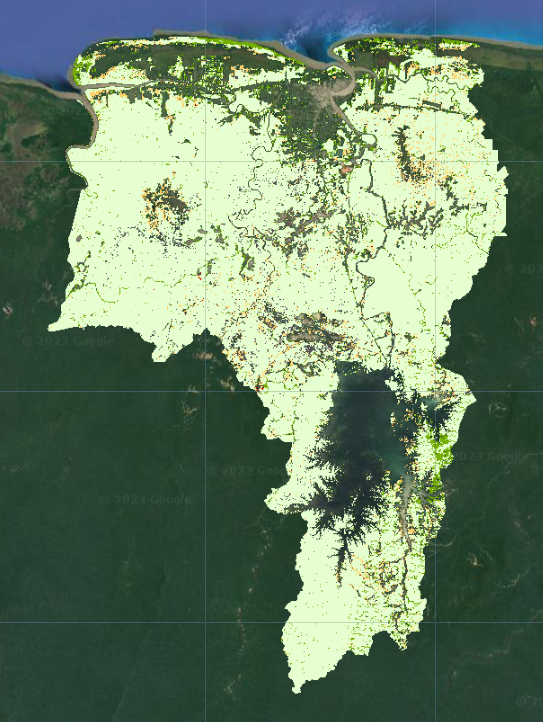

# Challenges

Do these challenges in any order you'd like to!

## Challenge 1

Calculate the areas of the other land cover classes in Year 1 and Year 2. Which land cover types increased and decreased in area between the two years?

## Challenge 2 

Create a change map for the other land cover classes. Do these changes in area make sense for all the classes, or are there probably some erroneous increases/decreases?

Can you think of other ways to categorize land cover changes that might be more descriptive of what actually happened on the ground?  For example, how could you specify forest loss due to conversion to agriculture vs. urban development vs. mining? 

## Challenge 3

Conduct an accuracy assessment on both of your land cover maps for Year 1 and Year 2.  Print the confusion matrix, overall accuracy, and user's/producer's accuracies.  How good would you say your maps are?

## Happy Coding!

# Solutions

### **Your actual maps and values will look different from the ones below if you use a different date range of interest, area of interest, or training data.  This is just *roughly* what they should look like.**

Uncomment the code at the bottom to get challenge solutions: [https://code.earthengine.google.com/?scriptPath=users%2Febihari%2FSurinameWS%3AChange%20Detection%20-%20Two%20Date%20v3](https://code.earthengine.google.com/?scriptPath=users%2Febihari%2FSurinameWS%3AChange%20Detection%20-%20Two%20Date%20v3)

## Challenge 1

## Challenge 2 

## Challenge 3

