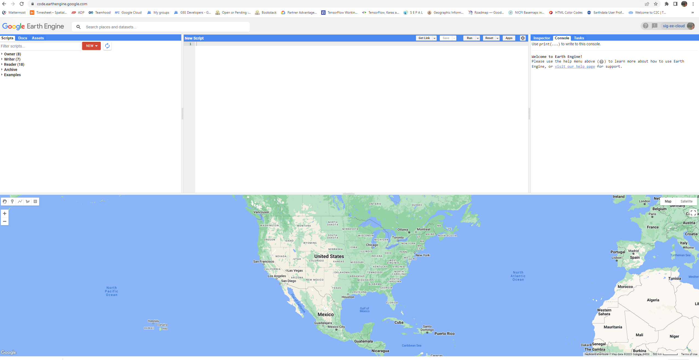
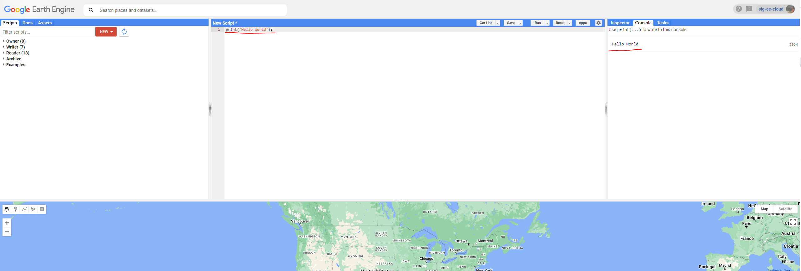
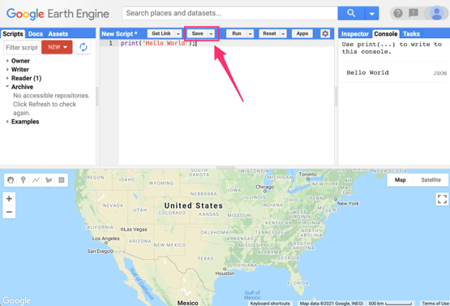
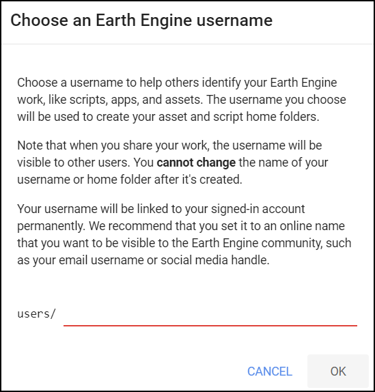
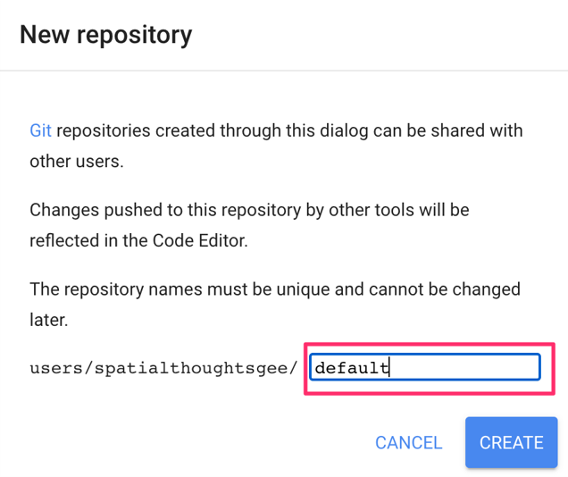
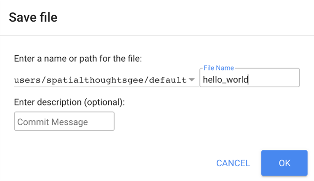
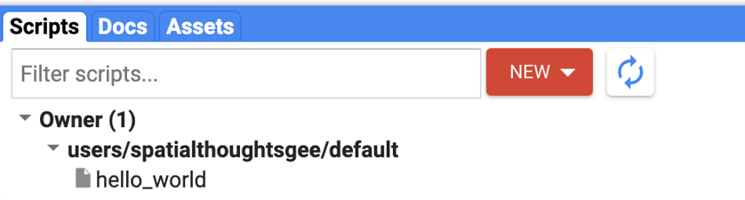

# Overview

## Section 1: Getting Started in the Code Editor
If you have not already done so, you can add the training’s code repository to the Code Editor by clicking this link:
[https://code.earthengine.google.com/?accept_repo=users/kwoodward/trinidad-tobago](https://code.earthengine.google.com/?accept_repo=users/kwoodward/trinidad-tobago). The training’s scripts will then be available in the script manager panel to view, run, or modify. 

The Code Editor ([https://code.earthengine.google.com/](https://code.earthengine.google.com/)) is an integrated development environment for the Earth Engine JavaScript API. It offers an easy way to type, debug, run, and manage code. Once you have followed Google’s documentation on registering for an Earth Engine account, you should follow the documentation to open the Code Editor. When you first visit the Code Editor, you will see a screen such as the one shown below.



The Code Editor allows you to type JavaScript code and execute it. When you are first learning a new language and getting used to a new programming environment, it is customary to make a program to display the words “Hello World.” This is a fun way to start coding that shows you how to give input to the program and how to execute it. It also shows where the program displays the output. Doing this in JavaScript is quite simple. Copy the following code into the center panel. 

```javascript
print('Hello World');
```

The line of code above uses the JavaScript print function to print the text “Hello World” to the screen. Once you enter the code, click the Run button. The output will be displayed on the upper right-hand panel under the Console tab as shown below.



You now know where to type your code, how to run it, and where to look for the output. You just wrote your first Earth Engine script, so let’s save it. Click the Save button.



If this is your first time using the Code Editor, you will be prompted to choose an Earth Engine username. This username will be used to create your script folder in the cloud where all your code will be saved. You can pick a name of your choice, but remember that it cannot be changed and will forever be associated with your account. A good choice for the name would be your Google Account username.



Once your home folder is created, you will be prompted to enter a new repository. A repository can help you organize and share code. Your account can have multiple repositories and each repository can have multiple scripts inside it. To get started, you can create a repository named “default”



Finally, you will be able to save your script inside the newly created repository. Enter the name “hello_world” and click OK.



Once the script is saved, it will appear in the script manager panel (Fig. F1.0.7). The scripts are saved in the cloud and will always be available to you when you open the Code Editor.



Now you should be familiar with how to create, run, and save your scripts in the Code Editor. You are ready to start learning the basics of JavaScript.
