# Overview
In this module we will learn about Earth Engine's `ImageCollection` data structure, how to manipulate them, and we will explore some great `ImageCollection` datasets in the Earth Engine data catalog.

_Create a new script to follow along with the code in this lesson._

**Section 1. Image Collections: An Organized Set of Images**

You saw some of the basic ways to interact with an individual `ee.Image` in the section *Accessing Images*. However, depending on how long a remote sensing platform has been in operation, there may be thousands or millions of images collected of Earth. In Earth Engine, these are organized into an `ImageCollection`, a specialized data type that has specific operations available in the Earth Engine API. Like individual images, they can be viewed with `Map.addLayer`.

In this module, we will show you how to view and work with Image Collections' most basic attributes, and use these skills to view some of the major types of Image Collections in Earth Engine. This chapter will give a brief tour of the Earth Engine Data Catalog, which contains decades of satellite imagery and much more. We will view some of the different types of data sets in the following sections, including climate and weather data, digital elevation models and other terrain data, land cover, cropland, satellite imagery, and others.

**View an Image Collection**

The Landsat program from NASA and the United States Geological Survey (USGS) has launched a sequence of Earth observation satellites, named Landsat 1, 2, etc. Landsats have been returning images since 1972, making that collection of images the longest continuous satellite-based observation of the Earth's surface. We will now view images and basic information about one of the image collections that is still growing: collections of scenes taken by the Operational Land Imager aboard Landsat 8, which was launched in 2013. Copy and paste the following code into the center panel and click **Run**. While the enormous image catalog is accessed, it could take a couple of minutes to see the result in the Map area. You may note individual “scenes” being drawn, which equate to the way that the Landsat program partitions Earth into “paths” and “rows.” If it takes more than a couple of minutes to see the images, try zooming in to a specific area to speed up the process.

```javascript
/////
// View an Image Collection
/////

// Import the Landsat 8 Raw Collection.
var landsat8 = ee.ImageCollection('LANDSAT/LC08/C02/T1');

// Print the size of the Landsat 8 dataset.
print('The size of the Landsat 8 image collection is:', landsat8
.size());

// Try to print the image collection.
// WARNING! Running the print code immediately below produces an error because 
// the Console can not print more than 5000 elements.
print(landsat8);

// Add the Landsat 8 dataset to the map as a mosaic. The collection is 
// already chronologically sorted, so the most recent pixel is displayed.

Map.addLayer(landsat8,
    {
        bands: ['B4', 'B3', 'B2'],
        min: 5000,
        max: 15000
    },
    'Landsat 8 Image Collection');
```

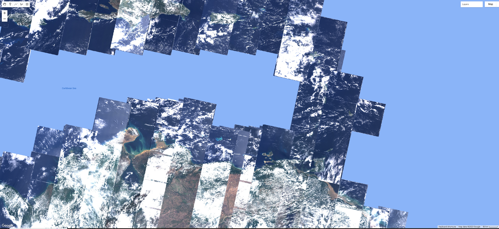

Notice the high amount of cloud cover, and the “layered” look. Zoom in or out if needed. This is because Earth Engine is drawing each of the images that make up the `ImageCollection` one on top of the other. The striped look is the result of how the satellite collects imagery. The overlaps between images and the individual nature of the images mean that these are not quite ready for analysis; we will address this issue in future chapters.

Now examine the printed size on the **Console**. It will indicate that there are more than a million images in the dataset. If you return to this lab in the future, the number will be even larger, since this active collection is continually growing as the satellite gathers more imagery. For the same reason, the above figure might look slightly different on your map because of this.

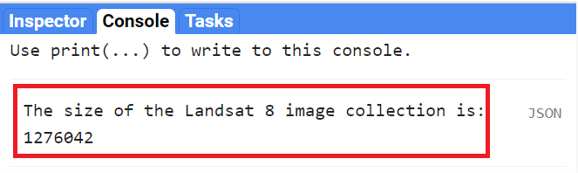

Note that printing the `ImageCollection` returned an error message, because calling print on an `ImageCollection` will print each image (and its metadata) in the collection to the **Console**. This is the result of an intentional safeguard within Earth Engine. We don’t want to see a million image names printed to the **Console**! 

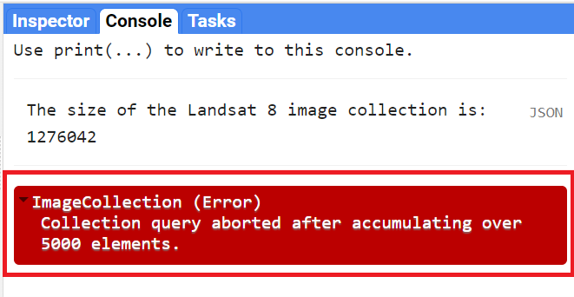

Code Checkpoint: [https://code.earthengine.google.com/3ab7f5b969df4dc5c9d7656b54d7db75](https://code.earthengine.google.com/3ab7f5b969df4dc5c9d7656b54d7db75)

Edit your code to comment out the last two code commands you have written. This will remove the call to `Map.addLayer` that drew every image, and will remove the `print` statement that demanded more than 5000 elements. This will speed up your code in subsequent sections. As described previously, placing two forward slashes (`//`) at the beginning of a line will make it into a comment, and any commands on that line will not be executed.

**Filtering Image Collections**

The `ImageCollection` data type in Earth Engine has multiple approaches to filtering, which helps to pinpoint the exact images you want to view or analyze from the larger collection.

**Filter by Date**

One of the filters is `filterDate`, which allows us to narrow down the date range of the `ImageCollection`. Copy the following code to the center panel (paste it after the previous code you had):

```javascript
/////
// Filter an Image Collection
/////

// Filter the collection by date.
var landsatWinter = landsat8.filterDate('2020-12-01', '2021-03-01');

Map.addLayer(landsatWinter,
    {
        bands: ['B4', 'B3', 'B2'],
        min: 5000,
        max: 15000
    },
    'Winter Landsat 8');

print('The size of the Winter Landsat 8 image collection is:',
    landsatWinter.size());
```

Examine the mapped `landsatWinter`. As described in *Accessing Images*, the 5000 and the 15000 values in the visualization parameters of the `Map.addLayer` function of the code above refer to the minimum and maximum of the range of display values. 

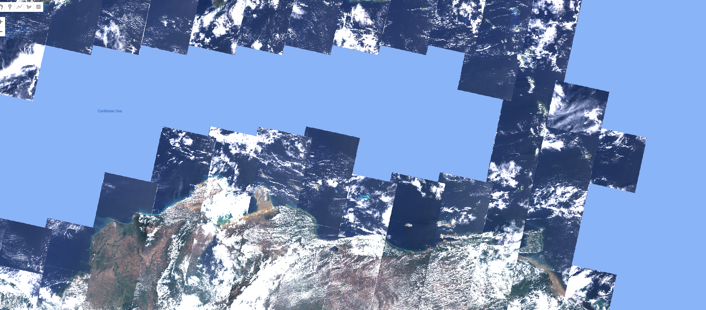

Now look at the size of the winter Landsat 8 collection. The number is significantly lower than the number of images in the entire collection. This is the result of filtering the dates to three months in the winter of 2020–2021.

**Filter by Location**

A second frequently used filtering tool is `filterBounds`. This filter is based on a location—for example, a point, polygon, or other geometry. Copy and paste the code below to filter and add to the map the winter images from the Landsat 8 Image Collection to a point in Valencia, Trinidad. Note below the `Map.addLayer` function to add the `point` to the map with an empty dictionary `{}` for the `visParams` argument. This only means that we are not specifying visualization parameters for this element, and it is being added to the map with the default parameters.

```javascript
// Create an Earth Engine Point object.
var point = ee.Geometry.Point([-61.22, 10.65]);

// Filter the collection by location using the point.
var landsatFiltered = landsatWinter.filterBounds(point);
Map.addLayer(landsatFiltered,
    {
        bands: ['B4', 'B3', 'B2'],
        min: 5000,
        max: 15000
    },
    'Filtered Landsat 8');

// Add the point to the map to see where it is.
Map.addLayer(point, {}, 'Point');

print('The size of the Valencia, Trinidad Winter Landsat 8 image collection is: ',
    landsatFiltered.size());
```

If we uncheck the Winter Landsat 8 layer under Layers, we can see that only images that intersect our point have been selected. Zoom in or out as needed. Note the printed size of the Valencia winter collection—we only have five images.

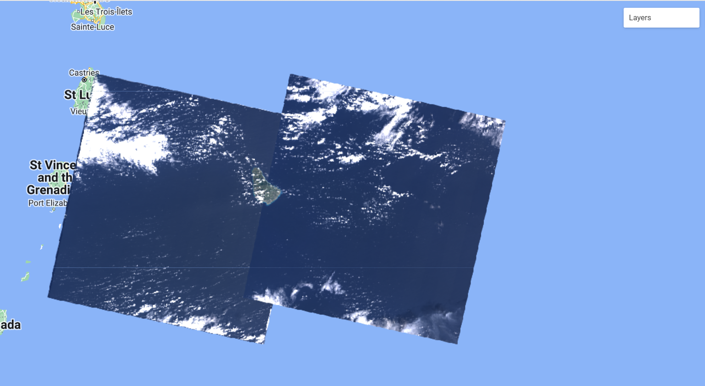

**Selecting the First Image**

The final operation we will explore is the first function. This selects the first image in an `ImageCollection`. This allows us to place a single image on the screen for inspection. Copy and paste the code below to select and view the first image of the Minneapolis Winter Landsat 8 Image Collection. In this case, because the images are stored in time order in the `ImageCollection`, it will select the earliest image in the set. 

```javascript
// Select the first image in the filtered collection.
var landsatFirst = landsatFiltered.first();

// Display the first image in the filtered collection.
Map.centerObject(landsatFirst, 9);
Map.addLayer(landsatFirst,
    {
        bands: ['B4', 'B3', 'B2'],
        min: 5000,
        max: 15000
    },
    'First Landsat 8');
```

The first command takes our stack of location-filtered images and selects the first image. When the layer is added to the Map area, you can see that only one image is returned—remember to uncheck the other layers to be able to visualize the full image. We used the `Map.centerObject` to center the map on the `landsatFirst` image with a zoom level of 9 (zoom levels go from 0 to 24).

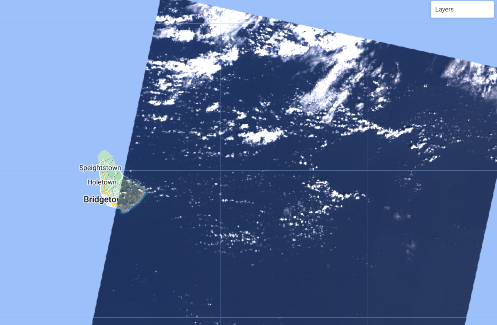

Code Checkpoint: [https://code.earthengine.google.com/fe44582875009fc3301e224d78960aca](https://code.earthengine.google.com/fe44582875009fc3301e224d78960aca)

Now that we have the tools to examine different image collections, we will explore other datasets. Save your script for your own future use. Then, refresh the Code Editor to begin with a new script for the next section.

**Section 2. Collections of Single Images**

When learning about image collections in the previous section, you worked with the Landsat 8 raw image dataset. These raw images have some important corrections already done for you. However, the raw images are only one of several image collections produced for Landsat 8. The remote sensing community has developed additional imagery corrections that help increase the accuracy and consistency of analyses. The results of each of these different imagery processing paths is stored in a distinct `ImageCollection` in Earth Engine.

Among the most prominent of these is the `ImageCollection` meant to minimize the effect of the atmosphere between Earth’s surface and the satellite. The view from satellites is made imprecise by the need for light rays to pass through the atmosphere, even on the clearest day. There are two important ways the atmosphere obscures a satellite’s view: by affecting the amount of sunlight that strikes the Earth, and by altering electromagnetic energy on its trip from its reflection at Earth’s surface to the satellite’s receptors. 

Unraveling those effects is called atmospheric correction, a highly complex process whose details are beyond the scope of this book. Thankfully, in addition to the raw images from the satellite, each image for Landsat and certain other sensors is automatically treated with the most up-to-date atmospheric correction algorithms, producing a product referred to as a “surface reflectance” `ImageCollection`. The surface reflectance estimates the ratio of upward radiance at the Earth's surface to downward radiance at the Earth's surface, imitating what the sensor would have seen if it were hovering a few feet above the ground.  

Let’s examine one of these datasets meant to minimize the effects of the atmosphere between Earth’s surface and the satellite. Copy and paste the code below to import and filter the Landsat 8 surface reflectance data (`landsat8SR`) by date and to a point over San Francisco, California, USA (`pointSF`). We use the `first` function to select the first image—a single image from March 18, 2014. By printing the `landsat8SRimage` image on the **Console**, and accessing its metadata, we see that the band names differ from those in the raw image. Here, they have the form  `“SR_B*”` as in “Surface Reflectance Band *”, where `*` is the band number. We can also check the date of the image by looking at the image “id” (Fig. F1.2.7). This has the value “20140318”, a string indicating that the image was from March 18, 2014.

```javascript
/////
// Collections of single images - Landsat 8 Surface Reflectance
/////

// Create and Earth Engine Point object over San Francisco.
var pointSF = ee.Geometry.Point([-122.44, 37.76]);

// Import the Landsat 8 Surface Reflectance collection.
var landsat8SR = ee.ImageCollection('LANDSAT/LC08/C02/T1_L2');

// Filter the collection and select the first image.
var landsat8SRimage = landsat8SR.filterDate('2014-03-18',
        '2014-03-19')
    .filterBounds(pointSF)
    .first();

print('Landsat 8 Surface Reflectance image', landsat8SRimage);
```

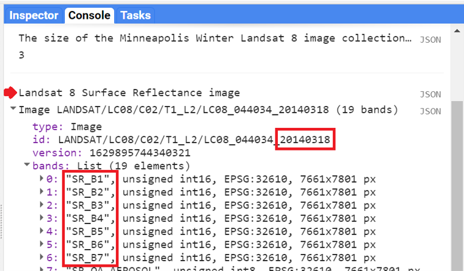

Copy and paste the code below to add this image to the map with adjusted R,G, and B bands in the “bands” parameter for true-color display 

```javascript
// Center map to the first image.
Map.centerObject(landsat8SRimage, 8);

// Add first image to the map.
Map.addLayer(landsat8SRimage,
    {
        bands: ['SR_B4', 'SR_B3', 'SR_B2'],
        min: 7000,
        max: 13000
    },
    'Landsat 8 SR');
```

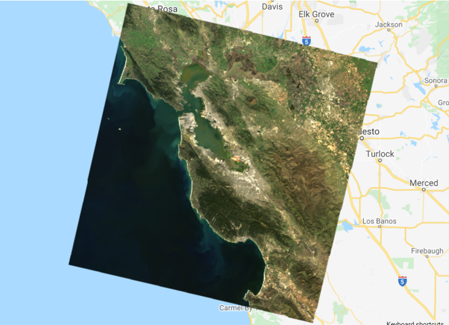

Compare this image with the raw Landsat 8 images from the previous section. Zoom in and out and pan the screen as needed. What do you notice? Save your script but don’t start a new one—we will keep adding code to this script.

Code Checkpoint: [https://code.earthengine.google.com/d790b1d04c9fe517ea5e5686ffff0ae7](https://code.earthengine.google.com/d790b1d04c9fe517ea5e5686ffff0ae7)

**Section 3. Pre-Made Composites**

Pre-made composites take individual images from image collections across a set area or time period and assemble them into a single layer. This can be done for many different datasets, including satellite images (e.g., MODIS, Landsat, Sentinel), climatological information, forest or vegetation information, and more.

For example, image collections may have multiple images in one location, as we saw in our “filter by location” example above. Some of the images might have a lot of cloud cover or other atmospheric artifacts that make the imagery quality poor. Other images might be very high quality, because they were taken on sunny days when the satellite was flying directly overhead. The compositing process takes all of these different images, picks the best ones, and then stitches them together into a single layer. The compositing period can differ for different datasets and goals; for example, you may encounter daily, monthly, and/or yearly composites. To do this manually is more advanced; however, with the pre-made composites available in Earth Engine, some of that complex work has been done for you.


**MODIS Daily True-Color Imagery**

We’ll explore two examples of composites made with data from the MODIS sensors, a pair of sensors aboard the Terra and Aqua satellites. On these complex sensors, different MODIS bands produce data at different spatial resolutions. For the visible bands, the lowest common resolution is 500 m (red and NIR are 250 m).

Let’s use the code below to import the MCD43A4.006 MODIS Nadir BRDF-Adjusted Reflectance Daily 500 m dataset and view a recent image. This dataset is produced daily based on a 16-day retrieval period, choosing the best representative pixel from the 16-day period. The 16-day period covers about eight days on either side of the nominal compositing date, with pixels closer to the target date given a higher priority.

```javascript
/////
// Pre-made composites
/////

// Import a MODIS dataset of daily BRDF-corrected reflectance.
var modisDaily = ee.ImageCollection('MODIS/006/MCD43A4');

// Filter the dataset to a recent date.
var modisDailyRecent = modisDaily.filterDate('2021-11-01');

// Add the dataset to the map.
var modisVis = {
    bands: [
        'Nadir_Reflectance_Band1',
        'Nadir_Reflectance_Band4',
        'Nadir_Reflectance_Band3'
    ],
    min: 0,
    max: 4000
};
Map.addLayer(modisDailyRecent, modisVis, 'MODIS Daily Composite');
```

Uncheck the other layers, zoom out (e.g., country-scale) and pan around to your area of interest. Notice how there are no clouds in the image, but there are some pixels with no data. These are persistently cloudy areas that have no clear pixels in the particular period chosen. 

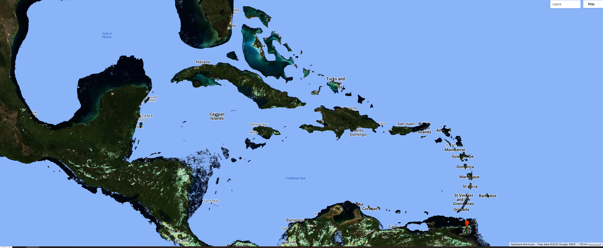

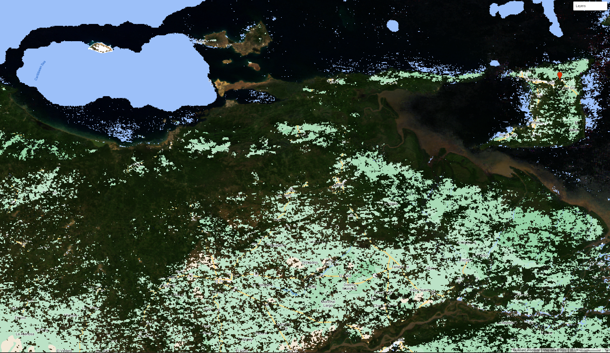

**MODIS Monthly Burned Areas**

Some of the MODIS bands have proven useful in determining where fires are burning and what areas they have burned. A monthly composite product for burned areas is available in Earth Engine. Copy and paste the code below. 

```javascript
// Import the MODIS monthly burned areas dataset.
var modisMonthly = ee.ImageCollection('MODIS/006/MCD64A1');

// Filter the dataset to a recent month during fire season.
var modisMonthlyRecent = modisMonthly.filterDate('2021-08-01');

// Add the dataset to the map.
Map.addLayer(modisMonthlyRecent, {}, 'MODIS Monthly Burn');
```

Uncheck the other layers, and then pan and zoom around the map. Areas that have burned in the past month will show up as red. Can you see where fires burned areas of California, USA? In Southern and Central Africa? Northern Australia?

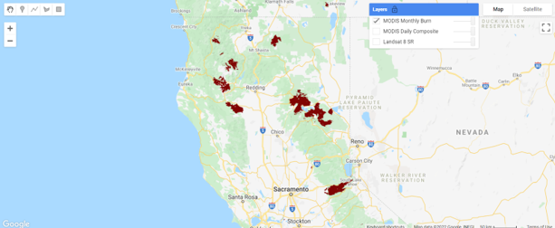

Code Checkpoint: [https://code.earthengine.google.com/388bc5d08727009285eb7f00d547dd22](https://code.earthengine.google.com/388bc5d08727009285eb7f00d547dd22)

**Section 4. Other Satellite Products**

Satellites can also collect information about the climate, weather, and various compounds present in the atmosphere. These satellites leverage portions of the electromagnetic spectrum and how different objects and compounds reflect when hit with sunlight in various wavelengths. For example, methane (CH4) reflects the 760 nm portion of the spectrum. Let’s take a closer look at a few of these datasets.

**Methane**

The European Space Agency makes available a methane dataset from Sentinel-5 in Earth Engine. Copy and paste the code below to add to the map methane data from the first time of collection on November 28, 2018. We use the `select` function to select the methane-specific band of the dataset. We also introduce values for a new argument for the visualization parameters of `Map.addLayer`: We use a color palette to display a single band of an image in color. Here, we chose varying colors from black for the minimum value to red for the maximum value. Values in
between will have the color in the order outlined by the `palette` parameter (a list of string colors: blue, purple, cyan, green, yellow, red).

```javascript
/////
// Other satellite products
/////

// Import a Sentinel-5 methane dataset.
var methane = ee.ImageCollection('COPERNICUS/S5P/OFFL/L3_CH4');

// Filter the methane dataset.
var methane2018 = methane.select(
        'CH4_column_volume_mixing_ratio_dry_air')
    .filterDate('2018-11-28', '2018-11-29')
    .first();

// Make a visualization for the methane data.
var methaneVis = {
    palette: ['black', 'blue', 'purple', 'cyan', 'green',
        'yellow', 'red'
    ],
    min: 1770,
    max: 1920
};

// Center the Map.
Map.centerObject(methane2018, 3);

// Add the methane dataset to the map.
Map.addLayer(methane2018, methaneVis, 'Methane');
```

Notice the different levels of methane over the African continent.

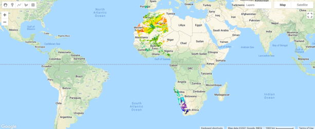

**Weather and Climate Data**

Many weather and climate datasets are available in Earth Engine. One of these is the European Center for Medium-Range Weather Forecast Reanalysis (ERA5) dataset used by Sulova and Jokar (2021). Copy and paste the code below to add the January 2018 monthly data to the map. 

```javascript
// Import the ERA5 Monthly dataset
var era5Monthly = ee.ImageCollection('ECMWF/ERA5/MONTHLY');

// Filter the dataset
var era5MonthlyTemp = era5Monthly.select('mean_2m_air_temperature')
    .filterDate('2018-01-01', '2018-01-31')
    .first();

// Add the ERA dataset to the map.                  
Map.addLayer(era5MonthlyTemp,
    {
        palette: ['yellow', 'red'],
        min: 260,
        max: 320
    },
    'ERA5 Max Monthly Temp');
```

Examine some of the temperatures in this image by using the **Inspector** tool. Pan and zoom out if needed. The units are in Kelvin, which is Celsius plus 273.15 degrees. 

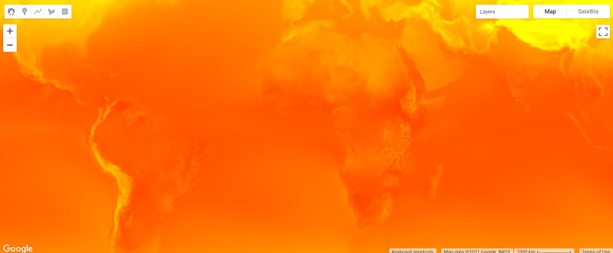

Code Checkpoint: [https://code.earthengine.google.com/f5c2aa849889df83657d7f917ea2553b](https://code.earthengine.google.com/f5c2aa849889df83657d7f917ea2553b)

**Section 5. Pre-Classified Land Use and Land Cover**

Another type of dataset available in Earth Engine are LULC maps that have already been classified. Instead of showing how the Earth’s surface looks—that is, the visible and other electromagnetic spectrum reflectance detected by satellites—these datasets take satellite imagery and use it to assign a label to each pixel on Earth’s surface. For example, categories might include vegetation, bare soil, built environment (pavement, buildings), and water.

Let’s take a closer look at two of these datasets.

**ESA WorldCover**

The European Space Agency (ESA) provides a global land cover map for the year 2020 based on Sentinel-1 and Sentinel-2 data. WorldCover uses 11 different land cover classes including built up, cropland, open water, and mangroves. Copy and paste the code below to add this image to the map. In this dataset, the band 'Map' already contains a palette color associated with the 11 land cover class values.

```javascript
/////
// Pre-classified Land Use Land Cover
/////

// Import the ESA WorldCover dataset.
var worldCover = ee.ImageCollection('ESA/WorldCover/v100').first();

// Center the Map.
Map.centerObject(worldCover, 3);

// Add the worldCover layer to the map.
Map.addLayer(worldCover, {
    bands: ['Map']
}, 'WorldCover');
```

Examine the WorldCover land cover classification. Compare it with some of the satellite imagery we have explored in previous sections. 

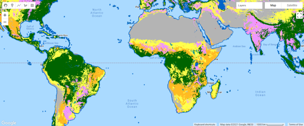

**Global Forest Change**

Another land cover product that has been pre-classified for you and is available in Earth Engine is the Global Forest Change dataset. This analysis was conducted between 2000 and 2020. Unlike the WorldCover dataset, this dataset focuses on the percent of tree cover across the Earth’s surface in a base year of 2000, and how that has changed over time. Copy and paste the code below to visualize the tree cover in 2000. Note that in the code below we define the visualization parameters as a variable `treeCoverViz` instead of having its calculation done within the `Map.addLayer` function.

```javascript
// Import the Hansen Global Forest Change dataset.
var globalForest = ee.Image(
    'UMD/hansen/global_forest_change_2020_v1_8');

// Create a visualization for tree cover in 2000.
var treeCoverViz = {
    bands: ['treecover2000'],
    min: 0,
    max: 100,
    palette: ['black', 'green']
};

// Add the 2000 tree cover image to the map.
Map.addLayer(globalForest, treeCoverViz, 'Hansen 2000 Tree Cover');
```

Notice how areas with high tree cover (e.g., the Amazon) are greener and areas with low tree cover are darker. In case you see an error on the **Console** such as “Cannot read properties of null,” don’t worry. Sometimes Earth Engine will show these transient errors, but they won’t affect the script in any way.

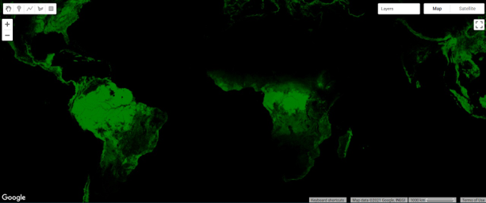

Copy and paste the code below to visualize the tree cover loss over the past 20 years.

```javascript
// Create a visualization for the year of tree loss over the past 20 years.
var treeLossYearViz = {
    bands: ['lossyear'],
    min: 0,
    max: 20,
    palette: ['yellow', 'red']
};

// Add the 2000-2020 tree cover loss image to the map.
Map.addLayer(globalForest, treeLossYearViz, '2000-2020 Year of Loss');
```

Leave the previous 2000 tree cover layer checked and analyze the loss layer on top of it—yellow, orange, and red areas. Pan and zoom around the map. Where has there been recent forest loss (which is shown in red)?


Code Checkpoint: [https://code.earthengine.google.com/0afa124b2f86eff88a497eca9bafd834](https://code.earthengine.google.com/0afa124b2f86eff88a497eca9bafd834)

**Section 6. Other Datasets**

There are many other types of datasets in the Earth Engine Data Catalog that you can explore and use for your own analyses. These include global gridded population counts, terrain, and geophysical data. Let’s explore two of these datasets now.

**Gridded Population Count**

The Gridded Population of the World dataset estimates human population for each grid cell across the entire Earth’s surface. Copy and paste the code below to add the 2000 population count layer. We use a predefined palette populationPalette, which is a list of six-digit strings of hexadecimal values representing additive RGB colors. Lighter colors correspond to lower population count, and darker colors correspond to higher population count.

```javascript
/////
// Other datasets
/////

// Import and filter a gridded population dataset.
var griddedPopulation = ee.ImageCollection(
        'CIESIN/GPWv411/GPW_Population_Count')
    .first();

// Predefined palette.
var populationPalette = [
    'ffffe7',
    '86a192',
    '509791',
    '307296',
    '2c4484',
    '000066'
];

// Center the Map.
Map.centerObject(griddedPopulation, 3);

// Add the population data to the map.
Map.addLayer(griddedPopulation,
    {
        min: 0,
        max: 1200,
        'palette': populationPalette
    },
    'Gridded Population');
```

Pan around the image. What happens when you change the minimum and maximum values in the visualization? The minimum and maximum values represent the range of values of the dataset. Identify a location of interest to you—maybe an area near your current location, or your hometown. If you click on the **Inspector** tab, you should be able to find the population count.

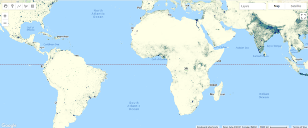

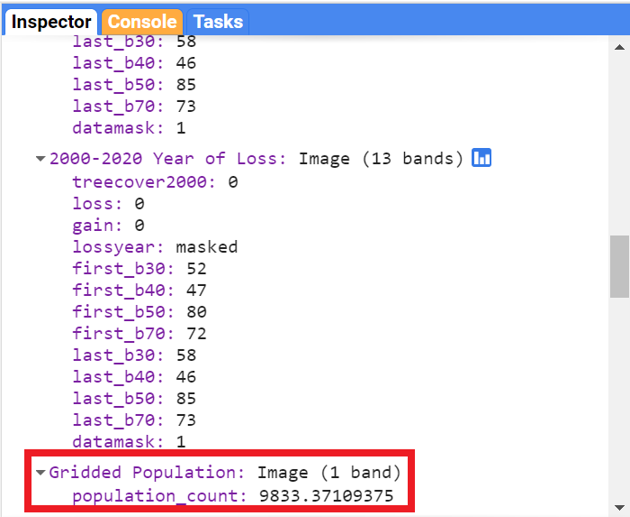

**Digital Elevation Models**

Digital elevation models (DEMs) use airborne and satellite instruments to estimate the elevation of each location. Earth Engine has both local and global DEMs available. One of the global DEMs available is the NASADEM dataset, a DEM produced from a NASA mission. Copy and paste the code below to import the dataset and visualize the elevation band.

```javascript
// Import the NASA DEM Dataset.
var nasaDEM = ee.Image('NASA/NASADEM_HGT/001');

// Add the elevation layer to the map.
Map.addLayer(nasaDEM, {
    bands: ['elevation'],
    min: 0,
    max: 3000
}, 'NASA DEM');
```

Uncheck the population layer and zoom in to examine the patterns of topography. Can you see where a mountain range is located? Where is a river located? Try changing the minimum and maximum in order to make these features more visible. Save your script.

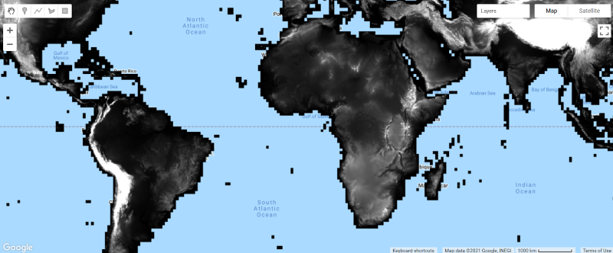

Code Checkpoint: [https://code.earthengine.google.com/d4b88c84ae5d9051f76981fea38ae6c3](https://code.earthengine.google.com/d4b88c84ae5d9051f76981fea38ae6c3)

**Allen Coral Atlas (ACA)**

The Allen Coral Atlas dataset maps the geomorphic zonation and benthic habitat for the world's shallow coral reefs at 5 m pixel resolution. Also included is a global reef extent product that maps additional reef areas unable to be explicitly included in the geomorphic and benthic mapping. The product used temporal composites of PlanetScope satellite imagery spanning 2018-2020.


```javascript
var dataset = ee.Image('ACA/reef_habitat/v2_0');

// Barbados geographic coordinates.
Map.setCenter(-59.5708, 13.1834, 13);
Map.setOptions('SATELLITE');

// The visualisations are baked into the image properties.

// Example mask application.
var reefExtent = dataset.select('reef_mask').selfMask();
Map.addLayer(reefExtent, {}, 'Global reef extent');

// Geomorphic zonation classification.
var geomorphicZonation = dataset.select('geomorphic').selfMask();
Map.addLayer(geomorphicZonation, {}, 'Geomorphic zonation');

// Benthic habitat classification.
var benthicHabitat = dataset.select('benthic').selfMask();
Map.addLayer(benthicHabitat, {}, 'Benthic habitat');
```

Take a moment to look through all of the different layers that we have explored so far. You can open your scripts one at a time or in different tabs, or even by copying the code into one single script. Turn the layers on and off, pan around, and zoom in and out accordingly to visualize the different datasets on the map. 
