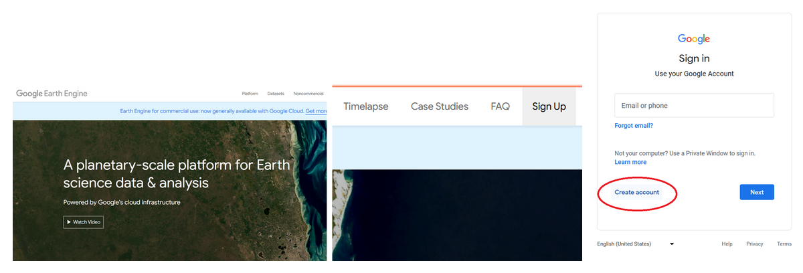
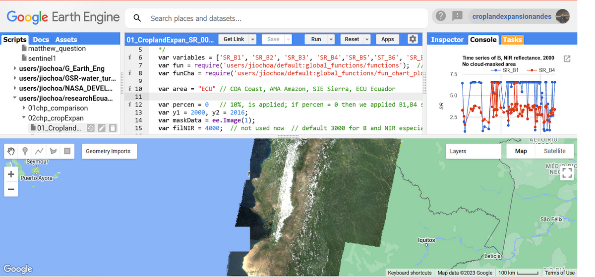

# Introduction

Welcome to an Introduction to Google Earth Engine (GEE)! This workshop will give an overview of the cloud-based geospatial platform Google Earth Engine, its benefits over desktop geospatial software, access to a large catalog of remote sensing datasets, language programming fundamentals, cloud-masking and image geoprocessing functions.

## Objectives

1. Getting familiar with the GEE platform and its programming environment.
2. Understanding the programming paradigm and fundamentals using Javascript/Python languages.
3. Learning the main commands and procedures to retrieve, geoprocess, visualize and export imagery, composites and/or mosaics.

## Requirements

1. You will need in advance to have a GEE account approved. Go the GEE website and sign up for a new user account: [https://earthengine.google.com/signup/](https://earthengine.google.com/signup/).
2. Click this link to accept the caribbean-trainings GEE script repository - [https://code.earthengine.google.com/?accept_repo=users/kwoodward/caribbean-trainings](https://code.earthengine.google.com/?accept_repo=users/kwoodward/caribbean-trainings).
3. Download the [data](https://drive.google.com/drive/folders/1Aov0j6ASs6eQVel4EeiiZrGaDRhq5WGQ?usp=share_link) used in this training 

Figure 1. Interface of the Google Earth Engine (GEE) domain. a) General view. b) Sign up button. c) Create account button.

You will need to wait for a couple of days to have a reply from the GEE team confirming your access.

## Google Earth Engine (GEE) Platform

GEE is a cloud-based planetary scale environment for Earth science data, computer programming, and analysis (https://earthengine.google.com/). It allows us to access a diverse range of global and regional optical and radar datasets plus derived vectorial and raster products provided by different sources from the public and private sector.  The first step to use GEE is to have a GEE account and log in. The code editor can be accessed through https://code.earthengine.google.com.

Figure 2. GEE workspace interface.

The left menu comprises three tabs: Scripts, Docs, Assets: In the Scripts section you have all your code stored and organized in repositories, folders, subfolders and files.  You can arrange your scripts by project and also you are able to share permissions of access or edit to other GEE users. In the center you find the web-based code editor where you can insert your JS or Python code without any previous software installation. With the Apps button you are able to develop automatized small applications to process and visualize data in a more user-friendly manner and interface, while the Run button executes the code. On the left, we have three main panels: Inspector, Console, and Tasks.  In the Console zone we are able to see code errors or printed values, this allows us to debug our script. We will see the functionality of these ones as long as we perform the next exercises.

### Advantages over traditional desktop software
GEE provides a friendly interface to explore, retrieve and visualize (zoom/pan) satellite imagery without the need to download data, saving us time, disk storage space and network resources. Satellite products usually consist of heavy files in raster (tiff, hd5, etc.) or vectorial (kml, shapefile, xlm, etc.) formats.

### Introduction to JavaScript (JS)
JavaScript (JS) Application Programming Interface (API) is a programming language to write and debug code, visualize data, and develop online applications in GEE.  The Python language is also available to be used, however this training will be based on JS. In case it is needed, a translation from JS to Python (or vice versa) is easy to be implemented, and there are currently tools available to make this process automatically. In addition, the JS API is the most developed and easiest programming language to utilize when getting started.

### Analyzing programming structure.
Learning how to code JavaScript is not complicated.  The online code-editor allows mostly a structured-procedural programming paradigm. It means the code has a simple sintaxis and can be divided into functions. Main JS reserved words and commands that you might end up getting familiar with are:

- *var*: to declare new variables or functions
- *Import* and *Export*: to import and export datasets
- *addLayer*: to visualize new data layers.
- *function*: to create a new function that performs a specific task
- *map*: to apply a function over an image collection
- *clip*: to shape a raster or vector layer by a geometry or polygon
