# Satellite images in GEE - Browsing & pre-processing

This exercise will walk us through retrieving and visualizing Landsat 8 data collections. Create a new repository called ‘training-servir-gee’.

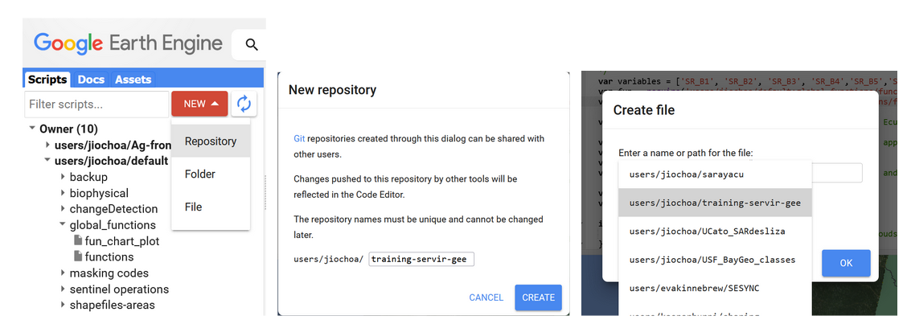

Figure 3. Creating a new script.

We set the name for our new script ‘sat_image_processing’.

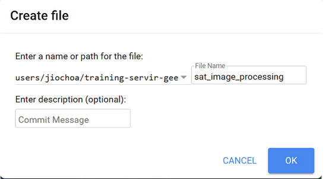

Figure 4. Naming a new script

We look for Landsat 8 surface reflectance (SR) Collection 2 Tier 1 data. Collection 1 is already deprecated and Tier 1 comprises the highest radiometric and terrain correction quality.

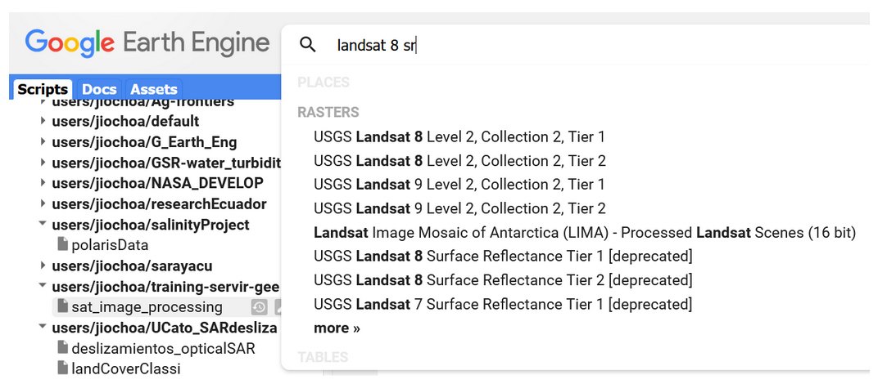

Figure 5. Catalog search bar showing Landsat datasets.

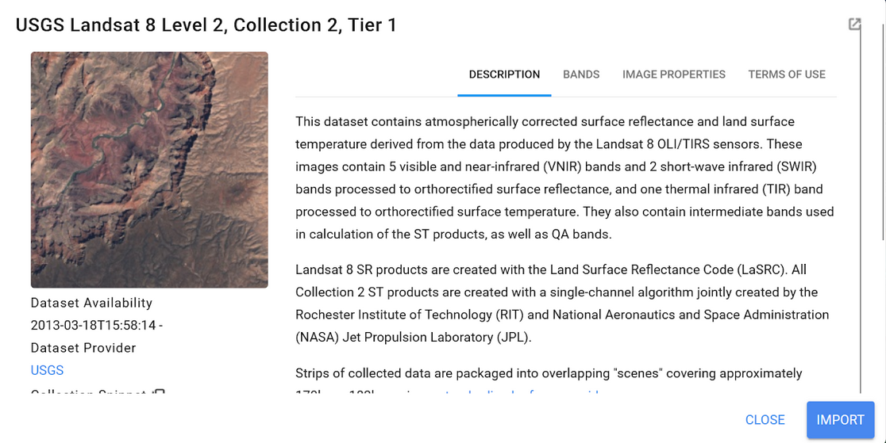

Figure 6. Landsat 8 description.

Lets hit the ‘Import’ button, and at the top of your script, change the name of the imported collection to ‘*landsat8_sr*’. 

Now let's download the boundary shapefile of Barbados. We are going to upload this file into the Assets section to have our country boundary available. Download the file `Barbados.zip` from the shared Google Drive [data folder](https://drive.google.com/drive/folders/1Aov0j6ASs6eQVel4EeiiZrGaDRhq5WGQ?usp=share_link). 

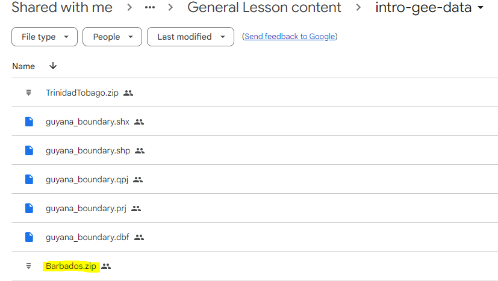

*If you do not have access to the Drive folder, please inform your instructor.*

Now that you have downloaded the boundary data locally, we must make a destination location in the GEE Assets. Create a new cloud project to hold your assets. Click *ADD A PROJECT* button within the Assets section:

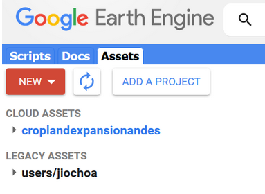

Figure 7. Adding a new project

Provide a name or id for the new cloud project,and then press ‘Select’.

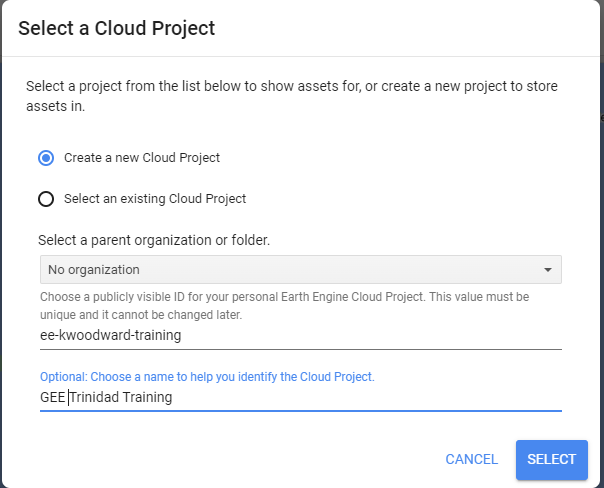

Figure 8. Cloud project set-up window.

Now at the top of the Assets tab, press the *New* button and select the *Shape files* options within the *Table Upload* section. When selecting the shapefile, you will need to ensure all its accompanying files are included (it will give you an error), or you can provide a zipped file containing all the necessary files. In our case, we have a zipped file, so select it. You can also change the Asset Name in the Asset ID field if you do not like the default. Click *Upload*.  

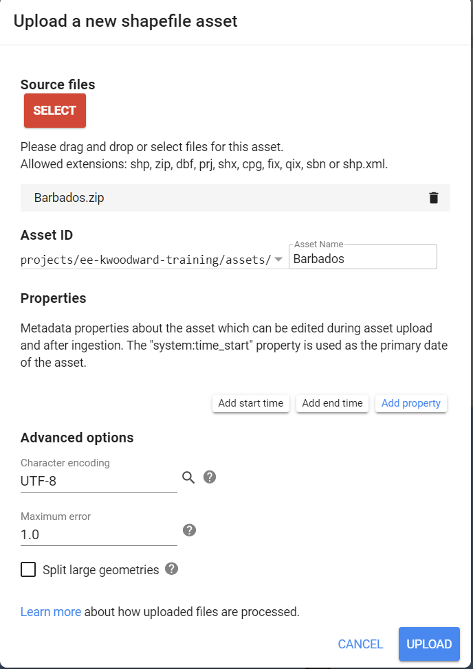

Figure 9. Uploading a new shapefile into the Assets.


Figure 10. Shapefile properties.

The two-arrows icon permits us to refresh the view in case you don’t see the uploaded file. We click on the file name to open it:

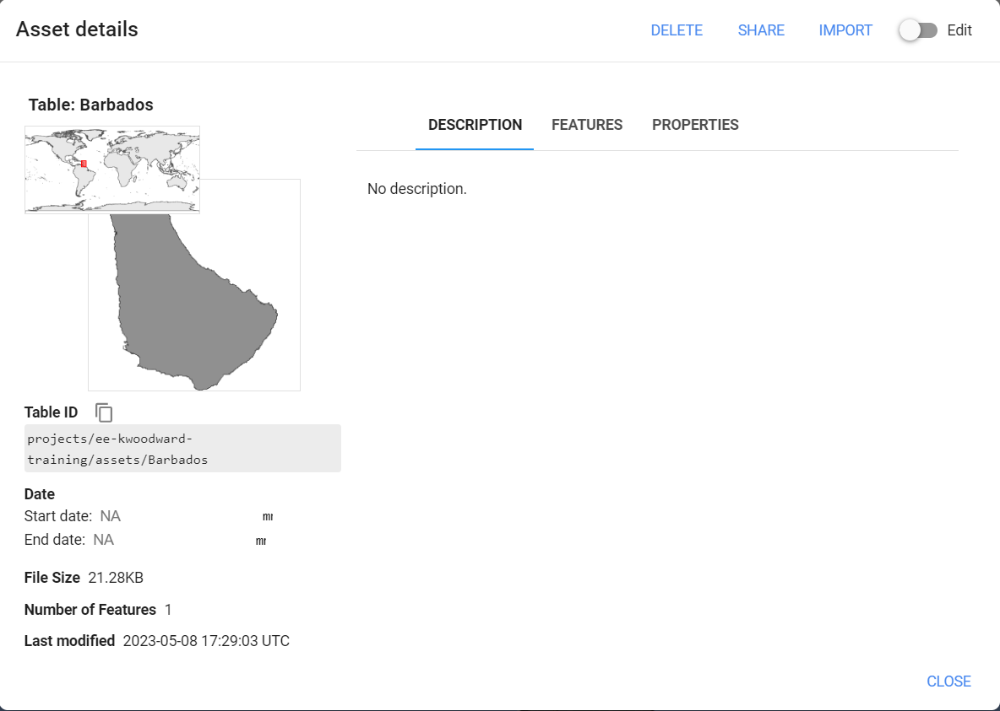

Figure 11. Shapefile loaded.

Click on ‘*Import*’ and change the name to *barbados_bou*. Now let’s work filtering our current image collection over three aspects: temporal, spatial, and spectral.

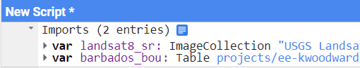

Figure 12. Typing an existent variable name

When typing you can press *Ctrl* + *spacebar* to autocomplete names of existent variables, or *Ctrl* + *spacebar* after inserting a point to observe a list of available functions

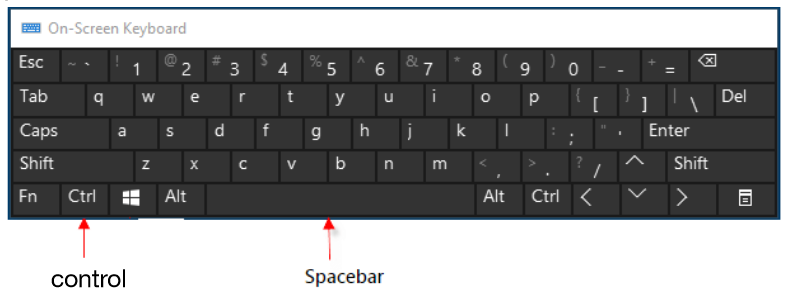

Figure 13. Keyboard shortcut

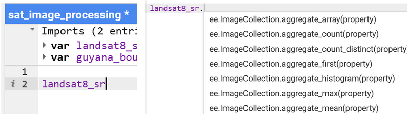

Figure 14. Available functions listed.

The following code selects 3 months of Landsat 8 imagery over Barbados. Immediately we apply a scale factor.

```javascript
landsat8_sr = landsat8_sr
.filterDate('2022-10-01', '2022-12-31')
.filterBounds(barbados_bou)

// Applies scaling factors needed for Landsat collection 02
function applyScaleFactors(image) {
  var opticalBands = image.select('SR_B.').multiply(0.0000275).add(-0.2);
  var thermalBands = image.select('ST_B.*').multiply(0.00341802).add(149.0);
  return image.addBands(opticalBands, null, true)
  .addBands(thermalBands, null, true);
}


landsat8_sr = landsat8_sr.map(applyScaleFactors);
// We can also select only the required bands, e.g. excluding the first band of coastal aerosol.  
// The visualization setting must be described.

var visualization = {
  bands: ['SR_B4', 'SR_B3', 'SR_B2'],
  min: 0.0,
  max: 0.3,
};

Map.centerObject(barbados_bou, 8)

// Now we visualize the layers created using the 
Map.addLayer(barbados_bou, {}, 'barbados', 0)
Map.addLayer(landsat8_sr, visualization, 'True Color (432)');
```

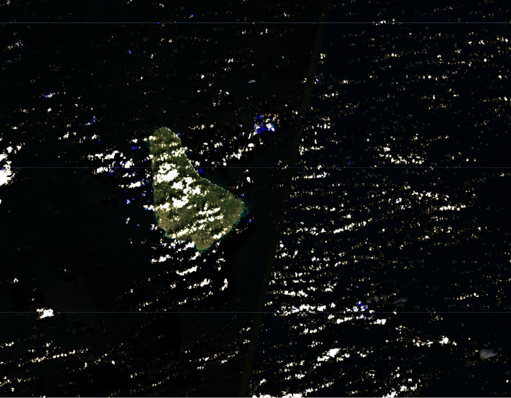

Figure 15. True color Landsat 8 collection 2 images for Barbados.

We have added the layer of surface reflectance (SR) values for 3 months to visualize. 

Checkpoint code link: [https://code.earthengine.google.com/15b399d5fc780a5bd24f2488f49153c3](https://code.earthengine.google.com/15b399d5fc780a5bd24f2488f49153c3).
